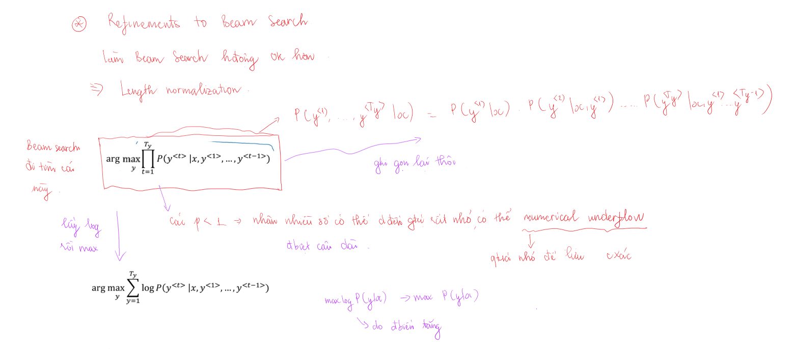
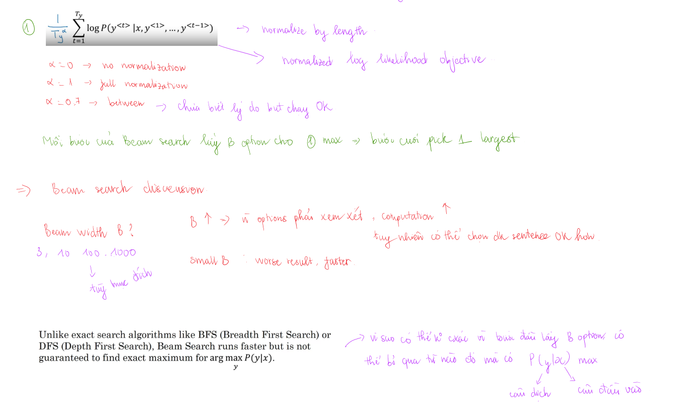
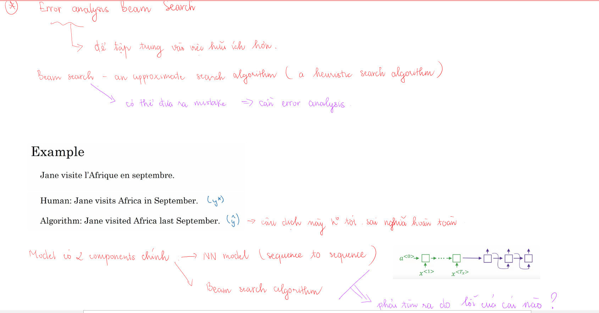
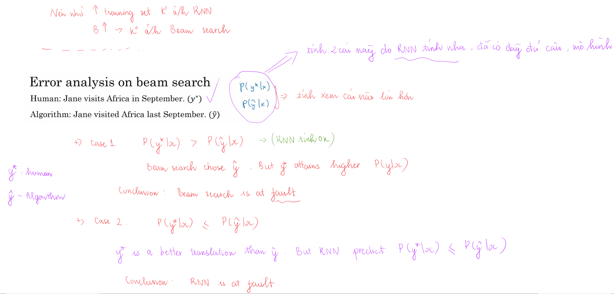
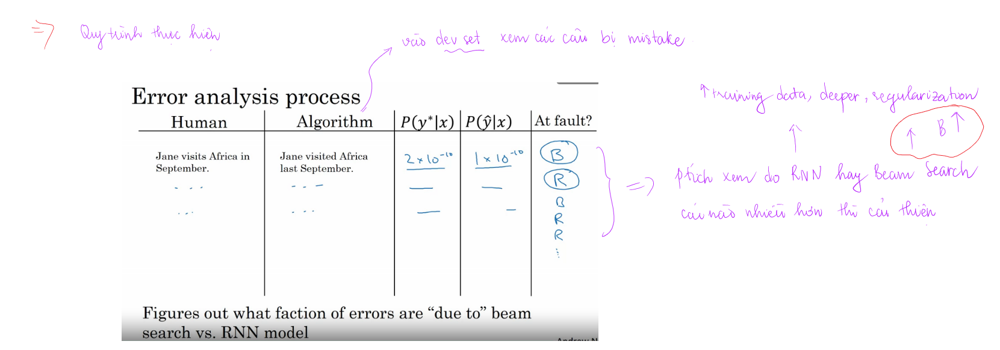
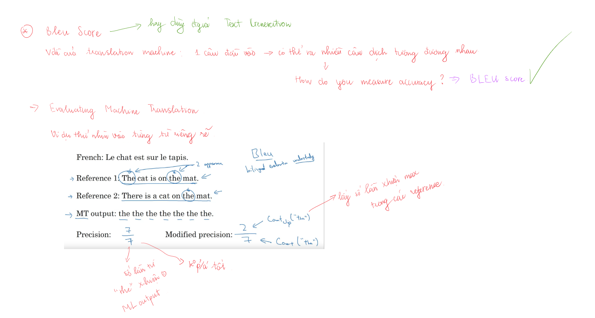

Sequen models có thể được tăng cường bằng `attention mechasnism`. Algorithm này giúp cho model biết chỗ nào nó nên tập trung vào của sequence of inputs.

# Various sequence to sequence architectures
## Basic models

## Picking the most likely sentence
### Finding the most likely transaletion - tìm câu dịch thích hợp nhất

Machine translation này giống conditional language model. Language model đi tạo ra các câu, tính xác suất của câu được tạo ta. Machine translation cũng tạo ra câu dịch tuy nhiên đi tính xác suất của câu dịch với điều kiện có câu input cần dịch. 

Đầu vào của language model là vector a<0>=0 còn đầu vào của machine translation có thể coi là encoding vector biểu diễn cho input sentence.

Việc chọn ngẫu nhiên câu dịch có thể đúng có thể sai (nghĩa hoàn toàn khác nhau). Do đó cần có algorithm để xác định max của xác suất có điều kiện.

### Vì sao không phải là Greedy Search

Greedy search không phải lúc nào cũng cho kết quả tốt nhất, nhìn ví dụ trong hình sẽ thấy. Nếu `vocab_size=10000`, một câu dịch có 10 từ, khi đó sẽ có 10000^10 số câu có thể tạo ra. Việc tìm kiếm và thử số câu này là không tưởng, do đó cần tìm kiếm cách thích hợp để chọn được câu có thể chấp nhận được mà không quá chậm

## Beam search
Beam search có tham số `Beam width B` (số option chọn ở mỗi bước (trước bước cuối)). Ở bước đầu tiên input sentence sẽ được chon vào encoding network rồi dự đoán y<1>, chọn ra `B` words cho xác suất cao nhất (có điều kiện là input sentence) từ softmax layer, lưu các giá trị lại

Ở bước thứ 2 cũng tương như bước 1, đối với mỗi từ trong số `B` từ được dự đoán đầu tiên sẽ đi xác định xác suất cho từ thứ 2, lúc này số option sẽ là `B * V` với V là `vocab_size`, sau đó cũng chọn ra `B` option sao cho P(y<1>, y<2>|x) = P(y<1>|x) * P(y<2>|x, y<1>) có giá trị lớn nhất.

Cứ làm như vậy đến cuối sẽ chọn ra option cho giá trị tốt nhất (theo cách của Beam Search).
Dưới đây là sơ đồ tổng quát về số lần tìm kiếm của mỗi bước của `Beam search`. Nếu `Beam width = 1` thì Beam search sẽ trở thành Greedy search.

## Refinements to Beam search
Trong quá trình thực hiện Beam search việc xác định tính các xác suất có thể trả về rất nhỏ (đặc biệt với câu dài), việc lưu trữ có thể không chính xác. Do đó một cách đơn giản là lấy log sau đó đi tìm max của nó.

Thường người ta cũng thực hiện `length normalization` đối với objective.

Việc lựa chọn `Beam width` phụ thuộc vào các mục đích khác nhau có thể 3...10...100...

Có một sô algorithm tìm chính xác hơn Beam search nhưng bù lại beam search rất nhanh (nguyên nhân không đảm bảo chính xác có thể do chỉ lấy mỗi lần B options nên có thể qua một số option mà sau này nó mới đem lại max probability).

## Error analysis in Beam Search

Beam search là approximate algorithm do đó nó có thể đưa ra một số mistake (một số câu dịch không đúng).

Nhớ là NN model (sequence to sequence) có 2 thành phần chính là:
- RNN
- Beam search
Việc đưa ra mistake có thể do trong hai thành phần trên. Error analysis sẽ giúp chúng ta xác định được thành phần gây ra lỗi và nên tập trung vào giải quyết nó (tìm đúng hướng để đi chứ không đi bừa).

Error analysis có thể tóm tắt như sau. Đi vào `dev set` lấy các câu bị dịch sai (bài toán translation amchine), lấy luôn cả ground-truth của câu đó. Khi chúng ta đã có model rồi có thể tính được xác suất xảy ra câu dịch khi cho câu ban đầu: P(y*|x) - cho ground-truth, P(y_hat|x) - cho câu trong dev set bị mistake. Sau đó đi so sánh 2 giá trị đó.

Có 2 trường hợp có thể xảy ra đối với 1 example trong dev set bị mistake:
-  `P(y*|x) > P(y_hat|x)`. Điều này chứng tỏ RNN đang làm tốt còn Beam search lại chọn y_hat. Vấn đề nằm ở `Beam Search`
- `P(y*|x) <= P(y_hat|x)`. y* là bản dịch tốt hơn mà RNN lại predict như vậy là không ổn rồi. Vấn đề nằm ở `RNN`.

Tóm lại đi v ào dev set lấy các câu bị mistake lập thành bảng như bên trên để phân tích lỗi. Nếu thấy tỉ lệ lỗi do `Beam Search` thì tập trung vào nó (tằng Beam Width), ngược lại nếu vấn đề là RNN có thể xem xét các phương án như regularization, tăng training set, deeper network...

## BLEU SCORE

Đối với bài toán tạo text (ví dụ machine translation) một câu đầu vào có thể cho nhiều câu dịch tốt tương đương nhau. Làm sao có thể đánh giá độ chính xác của mô hình được. `BLEU score` đã ra đời để làm `evaluation metric`. Ý tưởng chính của nó là xem các từ được dịch so với các từ trong nguồn tham khảo (references) có xuất hiện nhiều không.

Thử xem qua đối với unigram (1 từ)

Thử xem qua đối với bigram (2 từ cạnh nhau)

Phần này sẽ đưa vào công thức cho `Combines BLEU score`. Chú ý hệ số `BP` để tránh ảnh hưởng của các câu output ngắn. Do các câu output ngắn sẽ cho modified precision càng cao, tuy nhiên đây là điều không phải lúc nào chúng ta cũng mong muốn. Nếu câu càng ngắn thì chỉ số BP càng nhỏ.
