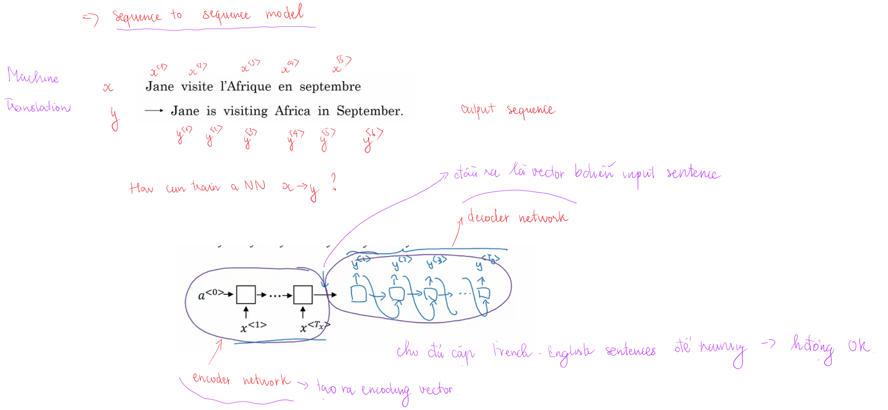
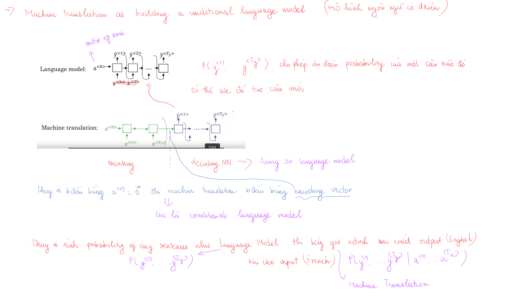
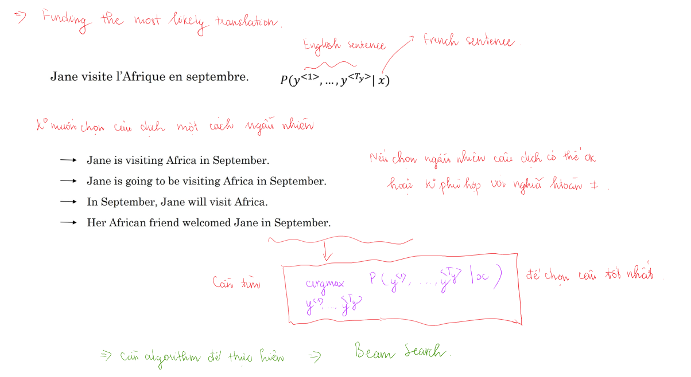
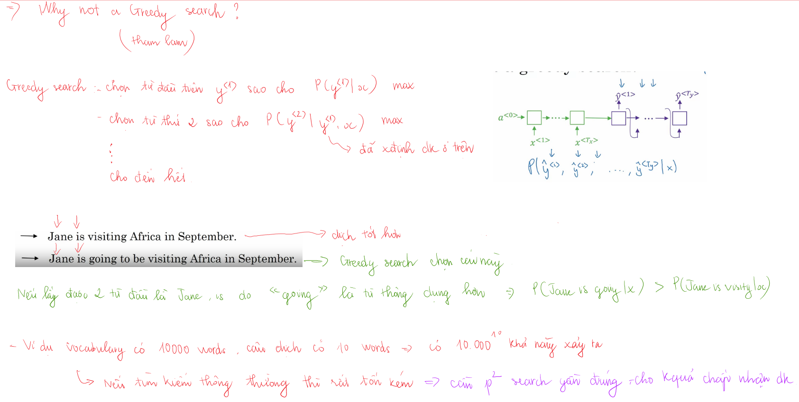
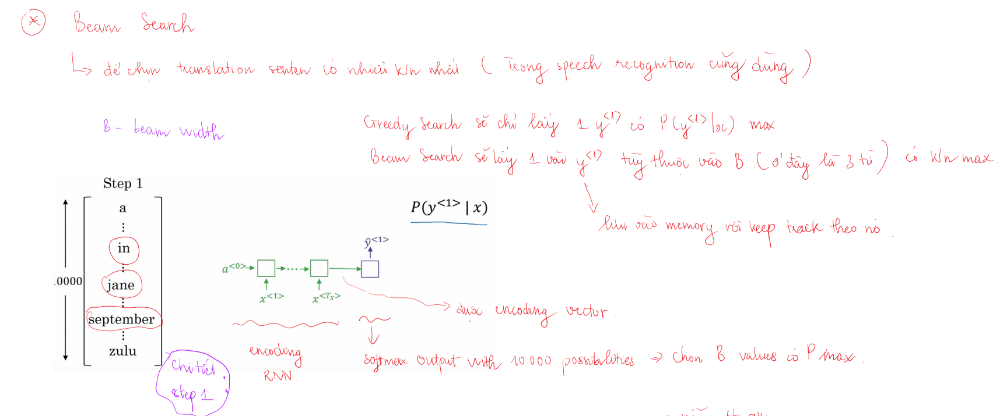
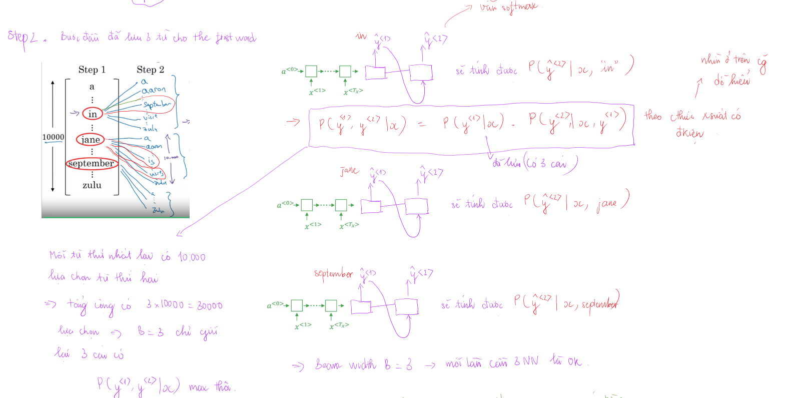
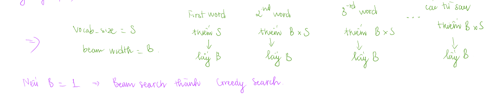

Sequen models có thể được tăng cường bằng `attention mechasnism`. Algorithm này giúp cho model biết chỗ nào nó nên tập trung vào của sequence of inputs.

# Various sequence to sequence architectures
## Basic models

## Picking the most likely sentence
### Finding the most likely transaletion - tìm câu dịch thích hợp nhất

Machine translation này giống conditional language model. Language model đi tạo ra các câu, tính xác suất của câu được tạo ta. Machine translation cũng tạo ra câu dịch tuy nhiên đi tính xác suất của câu dịch với điều kiện có câu input cần dịch. 

Đầu vào của language model là vector a<0>=0 còn đầu vào của machine translation có thể coi là encoding vector biểu diễn cho input sentence.

Việc chọn ngẫu nhiên câu dịch có thể đúng có thể sai (nghĩa hoàn toàn khác nhau). Do đó cần có algorithm để xác định max của xác suất có điều kiện.

### Vì sao không phải là Greedy Search

Greedy search không phải lúc nào cũng cho kết quả tốt nhất, nhìn ví dụ trong hình sẽ thấy. Nếu `vocab_size=10000`, một câu dịch có 10 từ, khi đó sẽ có 10000^10 số câu có thể tạo ra. Việc tìm kiếm và thử số câu này là không tưởng, do đó cần tìm kiếm cách thích hợp để chọn được câu có thể chấp nhận được mà không quá chậm

## Beam search
Beam search có tham số `Beam width B` (số option chọn ở mỗi bước (trước bước cuối)). Ở bước đầu tiên input sentence sẽ được chon vào encoding network rồi dự đoán y<1>, chọn ra `B` words cho xác suất cao nhất (có điều kiện là input sentence) từ softmax layer, lưu các giá trị lại

Ở bước thứ 2 cũng tương như bước 1, đối với mỗi từ trong số `B` từ được dự đoán đầu tiên sẽ đi xác định xác suất cho từ thứ 2, lúc này số option sẽ là `B * V` với V là `vocab_size`, sau đó cũng chọn ra `B` option sao cho P(y<1>, y<2>|x) = P(y<1>|x) * P(y<2>|x, y<1>) có giá trị lớn nhất.

Cứ làm như vậy đến cuối sẽ chọn ra option cho giá trị tốt nhất (theo cách của Beam Search).
Dưới đây là sơ đồ tổng quát về số lần tìm kiếm của mỗi bước của `Beam search`. Nếu `Beam width = 1` thì Beam search sẽ trở thành Greedy search.

