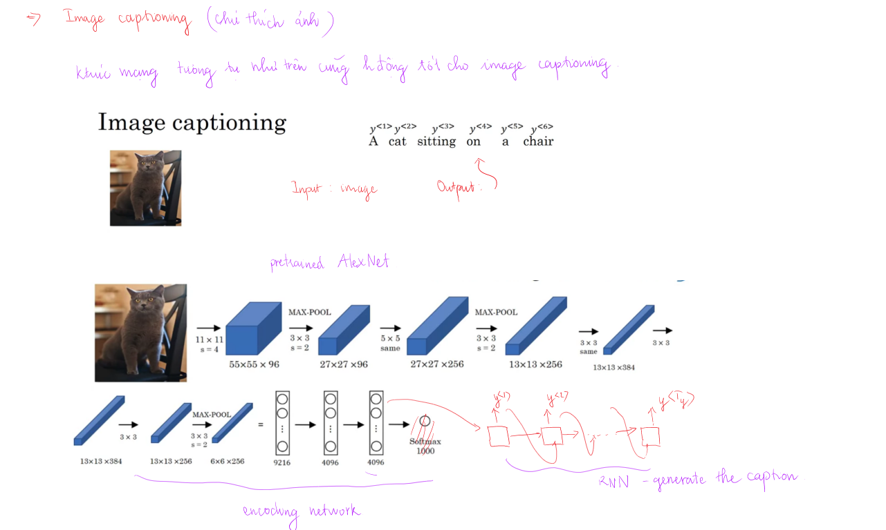
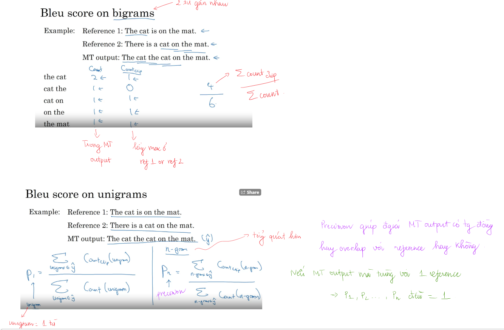

Sequence to sequence model được ứng dụng rộng rãi ví dụ machine translation, speech recognition. Sequence models có thể được tăng cường bằng `attention mechanism`. Algorithm này giúp cho model biết chỗ nào nó nên tập trung vào của sequence of inputs.

# Various sequence to sequence architectures

## Basic models

Chúng ta có một ví dụ như bên dưới về machine translation. Làm sau để train mạng NN để mapping X to Y.
https://medium.com/machine-learning-bites/deeplearning-series-sequence-to-sequence-architectures-4c4ca89e5654

Đầu tiên chúng ta có **encoder network** nhận vào input $x^{<1>}, x^{<2>}...x^{<T_x>}$. Encoder network này có thể là RNN, GRU hay LSTM. Đầu ra của encoder network chúng ta nhận được encoding của input, sau đó chúng ta cho nó qua **decoder network** và đưa ra dự đoán 

Nếu có đủ training examples French - English sentences chúng ta có thể xây dựng được model hoạt động tốt. Encoder network có nhiệm vụ tạo encoding cho input, decoder network có nhiệm vụ tạo ra câu tiếng Anh tương ứng với input.

Kiến trúc encoder-decoder như này cũng hoạt độn tốt đối với bài toán imgae captioning.

Ảnh ban đầu được cho đi qua pre-trained CNN, cuối cùng nhận được feature vector. Feature vector này được đưa vào mạng RNN để sinh caption. Cái này hoạt động khá tốt nếu caption không quá dài.

Cả bài toán sequence to sequence và image to sequence chúng ta không muốn chọn ngẫu nhiên các từ được sinh ra (giống bài toán sample sequence sinh từ, sinh nhạc). Ở đây chúng ta muốn chọn sequence được tạo ra có xác suất lớn nhất để phù hợp với bài toán của chúng ta.

## Picking the most likely sentence

**Machine translation as building a conditional language model**

Machine translation này giống *conditional language model*. Language model đi tạo ra các câu, tính xác suất của câu được tạo ta $ p(y^{<1>}, y^{<2>}...y^{<T_y>})$. Machine translation cũng tạo ra câu dịch tuy nhiên đi tính xác suất của câu dịch với điều kiện có câu input cần dịch $ p(y^{<1>}, y^{<2>}...y^{<T_y>}|x^{<1>}, x^{<2>}...x^{<T_x>})$. 

Đầu vào của language model là vector $a^{<0>}=0$ còn đầu vào của machine translation có thể coi là **encoding vector** biểu diễn cho input sentence. Phần decoder của machine translation có thể coi là NN của language model.

**Finding the most likely transaletion - tìm câu dịch thích hợp nhất**

$ p(y^{<1>}, y^{<2>}...y^{<T_y>}|x)$, $x$ là French sentence, $y$ là English sentence.

Trong machine translation chúng ta không lấy random các từ ở mỗi cell, điều này dẫn đến bản dịch khác nhau và không chính xác. Nhiệm vụ của chúng ta là tìm English sentence $y$ sao cho conditional probability lớn nhất:

$$\underset{y^{<1>}, y^{<2>}...y^{<T_y>}}{\text{argmax}} p(y^{<1>}, y^{<2>}...y^{<T_y>}|x)$$

Do đó ở bài toán machine translation chúng ta cần thêm algorithm để xác định max của xác suất có điều kiện. Thuật toán hay dùng cho vấn đề này là **Beam Search**.

Có câu hỏi đặt ra là tại sao không dùng Greedy Search (tìm kiếm tham lam, mỗi lần lấy max nhất)?

**Vì sao không phải là Greedy Search**

Nói sơ qua về Greedy Search cho bài toán sequence to sequence:
- Chọn $y^{<1>}$ sao cho $p(y^{<1>}|x)$ lớn nhất (ở cell đầu tiên của decoder)
- Chọn $y^{<2>}$ sao cho $p(y^{<2>}|y^{<1>},x)$ lớn nhất (cell thứ hai của decoder)
- Chọn $y^{<3>}$ sao cho $p(y^{<3>}|y^{<2>}, y^{<1>},x)$ lớn nhất
- Làm như vậy cho đến hết

Greedy search không phải lúc nào cũng cho kết quả tốt nhất, nhìn ví dụ trong hình sẽ thấy. Greedy search sẽ chọn từ có xác suất lớn nhất, tuy nhiêu do trong training set có một số từ xuất hiện thường xuyên hơn so với các từ còn lại, do đó khả năng chúng được chọn cũng cao hơn trong một lần. Điều này có thể đưa đến những câu không đúng.

Nếu vocabulary có $\text{size}=10000$, một câu dịch có 10 từ, khi đó sẽ có $10000^{10}$ số câu có thể tạo ra. Việc tìm kiếm và thử nghiệm số câu này là không tưởng, do đó cần tìm kiếm cách thích hợp để chọn được câu có thể chấp nhận được mà thuật toán không quá chậm - approximate search algorithm.

## Beam search

Bài toán sequence to sequence như machine translation hay speech recognition chúng ta không thể chọn random mỗi từ được tạo ra mà phải chọn đoạn text có khả năng cao nhất. Do số lượng từ rất lớn nên việc tìm kiếm chính xác sẽ rất tốn kém, thuật toán Beam Search giúp chúng ta giải quyết vấn đề này cho kết quả chấp nhận được và giảm tính toán.

Beam search có tham số **Beam width B** (số option chọn ở mỗi bước - trước bước cuối). 
- **Bước 1:** input sentence sẽ được đưa vào encoding network rồi dự đoán $y^{<1>}$, chọn ra $B$ words cho xác suất cao nhất $p(y^{<1>}|x)$ (có điều kiện là input sentence) từ softmax layer, lưu các giá trị này lại. Ví dụ ở đây $B=3$ và từ đầu tiên có 3 lựa chọn: *in*, *jane*, *september*

- **Bước 2:** đối với từng từ trong số $B$ từ được chọn ở cell đầu tiên sẽ đi xác định xác suất cho từ thứ hai. Ví dụ với từ *in* chúng ta sẽ xác định được $p(y^{<2>}|x, \text{in})$. Sau đó sẽ đi tính $p(y^{<1>}, y^{<2>}|x) = p(y^{<1>}|x) \cdot p(y^{<2>}|x, y^{<1>})$ (có 10000 giá trị như này cho mỗi từ $y^{<1>}$ được chọn - vocab size).

Làm tương tự như vậy với các từ còn lại. Tổng cộng chúng ta sẽ có tổng số options là $B \cdot V$ với $V$ là vocabulary size và $B$ là Beam width. Sau đó cũng chọn ra $B$ options (ở đây là 3) sao cho $p(y^{<1>}, y^{<2>}|x)$ có giá trị lớn nhất. Ví dụ ở đây chọn được 3 cặp hai từ đầu tiên là: *in september*, *jane is*, *jane visits*. Ở đây đã loại bỏ *september* là từ đầu tiên.

Nên nhớ chúng ta có Beam width là $B$ do đó ở mỗi bước chúng ta có 3 bản copy của network cho 3 options khác nhau. Chúng ta không cần $B \cdot V$ bản copy của network để dự đoán. 

Cứ làm như vậy đến cuối sẽ chọn ra option cho giá trị tốt nhất (theo cách của Beam Search). Dấu hiệu dừng lại của câu có thể từ từ "EOS" - kí hiệu end of sentence mình đưa vào. Nếu trong quá trình tìm kiếm "EOS" lọt vào top $B$ của tìm kiếm chúng ta có thể dừng thuật toán lại?

Dưới đây là sơ đồ tổng quát về số lần tìm kiếm của mỗi bước của Beam search. Nếu Beam width $B= 1$ thì Beam search sẽ trở thành Greedy search.

## Refinements to Beam search (cải tiến thuật toán Beam Search)

Việc đầu tiên có thể làm là thực hiện **length normalization**.

$$\underset{y^{<1>}, y^{<2>}...y^{<T_y>}}{\text{argmax}} p(y^{<1>}, y^{<2>}...y^{<T_y>}|x)$$ 

$$\underset{y}{\text{argmax}} ~~p(y^{<1>}, y^{<2>}...y^{<Ty>}|x)$$

$$p(y^{<1>}, y^{<2>}...y^{<T_y>}|x) = p(y^{<1>}|x) \cdot p(y^{<2>}|x, y^{<1>}) \cdot p(y^{<3>}|x, y^{<1>}, y^{<2>})...p(y^{<Ty>}|x, y^{<1>}, y^{<2>}...y^{<Ty-1>})=\prod_{t=1}^{T_y} p(y^{<t>}|x,y^{<1>},..., y^{<t-1>})$$

Qua một số phép biến đổi chốt lại Beam Search đi tìm max của cái này:

$$\underset{y}{\text{argmax}} \prod_{t=1}^{T_y} p(y^{<t>}|x,y^{<1>},..., y^{<t-1>})$$

Trong quá trình thực hiện Beam search chúng ta cần phải tính các xác suất như biểu thức trên, chúng là những giá trị nhỏ hơn 1, thường là những giá trị nhỏ hơn 1 rất nhiều (đặc biệt với câu dịch dài). Tích của chúng có thể là một giá trị rất nhỏ, việc lưu trữ có thể không chính xác (numerical underflow) dẫn đến so sánh không còn chính xác. Do đó một cách đơn giản là lấy log sau đó đi tìm max của nó.

$$\underset{y}{\text{argmax}} \sum_{t=1}^{T_y} log ~ p(y^{<t>}|x,y^{<1>},..., y^{<t-1>})$$

Chúng ta làm được điều này do hàm $log$ là hàm đơn điệu tăng, lúc này việc lưu giá trị sẽ chính xác hơn so với ban đầu.

Đối với một câu dịch dài, xác suất của câu đó thấp do chúng ta phải nhân nhiều xác suất nhỏ với nhau. Do đó *objective function* như trên sẽ có hiệu ứng không mong muốn rằng model có xu hướng đưa ra những câu dịch ngắn hơn (xác suất lớn hơn). Do đó ở đây chúng ta sẽ thực hiện **length normalization** đối với objective function để tránh việc model có xu hướng trả về câu ngắn.

$$\underset{y}{\text{argmax}} \sum_{t=1}^{T_y} \frac{1}{T_y^\alpha} log ~ p(y^{<t>}|x,y^{<1>},..., y^{<t-1>})$$

$\alpha = 0.7$ hay được chọn (không có giải thích rõ ràng, cái này từ kinh nghiệm), nếu $\alpha = 1$ chúng ta normalize theo độ dài của câu dịch, nếu $\alpha = 0$ thì giống như ban đầu không làm gì.

Việc lựa chọn Beam width $B$ phụ thuộc vào các mục đích khác nhau có thể 3...10...100...1000. $B$ càng nhỏ thì tốc độ tính toán nhanh nhưng kết quả không chính xác bằng khi chọn $B$ lớn (tính toán chậm). Nếu đưa ứng dụng ra thị trường có thể để Beam width nhỏ để đảm bảo tốc độ.

Có một số algorithm tìm kiếm chính xác hơn như Breadth First Search (BFS) hay Depth First Search (DFS). Tuy nhiên Beam search nhanh hơn khá nhiều nhưng không đảm bảo tìm thấy giá trị làm cho objective function max (nguyên nhân không đảm bảo chính xác có thể do chỉ lấy mỗi lần B options nên có thể bỏ qua một số option mà sau này nó mới đem lại max probability). Beam search được sử dụng rất nhiều trong các hệ thống thương mại.

Trong các khóa học trước chúng ta đã tìm hiểu khá nhiều về **error analysis**. Trong bài sau chúng ta sẽ tìm hiểu error analysis để giúp cải thiện Beam Search hơn. Chúng ta sẽ biết khi nào nên tăng Beam width, với Beam width đó có hoạt động hiệu quả không.

## Error analysis in Beam Search

Error analysis là một phần rất quan trọng trong quá trình xây dựng model, nó giúp chúng ta biết nên tập trung vào phần nào để có thể cải thiện performance của model. Beam search là một approximate search algorithm, do đó nó có thể đưa ra một số mistake vì mỗi lần nó chỉ keep track $B$ options thôi (một số câu dịch không đúng).

Nhớ là NN model (sequence to sequence) có 2 thành phần chính là:
- RNN
- Beam search

Việc model đưa ra mistake có thể do một trong hai thành phần trên. Error analysis sẽ giúp chúng ta xác định được thành phần nào gây ra lỗi và nên tập trung vào giải quyết nó (tìm đúng hướng để đi chứ không đi bừa).

Ví dụ French sentence: *Jane visite l'Afrique en septembre*

Human: *Jane visits Africa in September* ($y^*$)

Algorithm: *Jane visites Africa last September* ($\hat{y}$)

Nhận thấy câu dịch mà algorithm đưa ra là không tốt do nó dịch sai nghĩa. Vậy lỗi do đâu? Việc thêm training data cũng giống như việc tăng Beam width $B$ không ảnh hưởng đến hiệu suất của model, tuy nhiên tăng $B$ có giải quyết được vấn đề đang gặp phải không? Có phải Beam width là nguyên nhân gây ra lỗi dịch?

Error analysis có thể tóm tắt như sau. Đi vào dev set lấy các câu bị dịch sai $x$ (bài toán translation machine), lấy luôn cả ground-truth (câu dịch đúng) của câu $x$ đó. Khi chúng ta có model RNN chúng ta có thể tính được xác suất xảy ra câu dịch khi cho câu ban đầu: $p(y^*|x)$ - cho ground-truth, $p(\hat{y}|x)$ - cho câu trong dev set $x$ bị dịch sai. Sau đó đi so sánh 2 giá trị đó.

>Cần tìm hiểu lại cách tính xác suất của một câu dịch khi có câu đầu vào $p(\hat{y}|x)$ 

Có 2 trường hợp có thể xảy ra đối với 1 example $x$ trong dev set bị mistake (dịch sai):
-  $p(y^*|x) > p(\hat{y}|x)$ - điều này chứng tỏ RNN đang làm tốt (xác suất câu dịch đúng lớn hơn xác suất câu dịch sai), còn Beam search lại chọn câu dịch $\hat{y}$. Vấn đề đang nằm ở **Beam Search**.
- $p(y^*|x) \leq P(\hat{y}|x)$ - $y^*$ là bản dịch tốt hơn mà RNN lại đưa ra xác suất nhỏ hơn so với bản dịch sai. Vấn đề đang nằm ở **RNN**.

Quá trình thực hiện error analysis được thể hiện như sau:

Tóm lại đi vào dev set lấy các câu bị mistake (bị dịch sai) lập thành bảng như bên trên để phân tích lỗi. Nếu thấy tỉ lệ lỗi do Beam Search lớn thì tập trung vào nó (tăng Beam Width), ngược lại nếu vấn đề là RNN có thể xem xét các phương án như regularization, tăng training set, deeper network, thay đổi kiến trúc...

## BLEU Score - Bilingual Evaluation Understudy

Đối với bài toán sequence to sequence (ví dụ machine translation) một câu đầu vào có thể cho nhiều câu dịch tốt tương đương nhau. Làm sao có thể đánh giá được độ chính xác của mô hình khi có nhiều sự lựa chọn tốt như vậy. Như ví dụ bên dưới làm sao đánh giá được MT system có tốt không? **BlEU score** đã ra đời để làm **evaluation metric**. Ý tưởng chính của nó là xem các từ được dịch so với các từ trong nguồn tham khảo (references) có xuất hiện nhiều không (xem bản dịch từ algorithm với bản dịch tham khảo có khớp nhiều từ không). Chúng ta gọi đó là **precision** của output so với references (tỉ lệ số từ xuất hiện trong references so với tổng số từ của ML output).

Câu input: *Le chat est sur le tapis*

Reference 1: *The cat is on the mat*

Reference 2: *There is a cat on the mat*

MT output: *The the the the the the the*

Cả 2 câu dịch tham khảo (từ 2 người khác nhau) đều đúng.
Thử xem qua đối với Unigram (1 từ) cho ví dụ trên. MT output có 7 từ *the*, từ này đều xuất hiện ít nhất trong một reference, do đó precision of ML output là $\frac{7}{7}$. Precision rất cao, dường như tốt nhưng câu dịch không ổn. Do đó chúng ta cần thay đổi cách tính precision một chút. Đối với những từ giống nhau trong ML output chúng ta chỉ lấy một lần duy nhất và xác định số lần xuất hiện lớn nhất trong số các references. Ví dụ từ *the* xuất hiện trong reference 1 hai lần, trong reference 2 một lần nên sẽ tính cho nó là 2. Tổng cộng chúng ta vẫn có 7 từ, do đó modidied precision là $\frac{2}{7}$.

>MÌNH CÒN CÂU HỎI: MỘT SỐ CÂU CÓ NHIỀU BẢN DỊCH THAM KHẢO NHƯ VẬY (HIỆN TẠI Ở ĐÂY TRONG VALIDATION SET), KHI XÂY DỰNG TRAINING SET CHÚNG TA CÓ SỬ DỤNG NHIỀU BẢN DỊCH LÀM CÁC LABEL CHO CÙNG MỘT CÂU INPUT KHÔNG?

Ở trên chúng ta chỉ đang quan tâm đến các từ riêng lẻ. Trong Blue score chúng ta cũng muốn quan tâm các cặp từ gần nhau. Chúng ta cũng có thể làm cho trigrams... 
Thử xem qua đối với bigram (2 từ cạnh nhau):
- Đầu tiên đếm số cặp từ gần nhau trong ML output, có tính lặp lại (ví dụ ở đây là 6)
- Bước 2 (tương như như cho một từ) - xem những cặp từ đó xuất hiện trong các references, xuất hiện trong reference nào với số lần nhiều nhất thì lấy giá trị đó cho cặp từ đó. Đối với các cặp từ lặp lại ở bước 1 chỉ tính một lần thôi.
- Xác định modified precision

Phần này đều ghi là count clip do mình chỉ lấy số lần max xuất hiện trong một reference nào đó chứ không lấy tổng số lần xuất hiện trong các references. 

$$p_1 = \frac{\sum_{uniram \in \hat{y}} Count_{clip}(unigram)} {\sum_{uniram \in \hat{y}} Count(unigram)}$$

Cho n-gram
$$p_n = \frac{\sum_{n-gram \in \hat{y}} Count_{clip}(n-gram)} {\sum_{n-gram \in \hat{y}} Count(n-gram)}$$

Nếu MT output trùng với một reference nào đó thì $p_1, p_2,...,p_n$ đều bằng 1. Trong một số trường hợp MT output không nhất thiết phải trùng với reference nào mà modified precision vẫn bằng 1 (các n-gram xuất hiện trong nhiều references). Chúng ta vẫn có thể kết hợp chúng và hy vongj có một bản dịch tốt. Modified precision giúp ta đánh giá MT output có overlap với references hay không.

Phần này sẽ đưa vào công thức cuối cùng cho BlEU score. $p_n$ là bleu score cho n-grams, $p_1$, $p_2$, $p_3$, $p_4$. Kết hợp chúng lại ta có **Combined Bleu score**.

$$\text{BP} \cdot exp(\frac{1}{4} \sum_{i=1}^{4} p_i)$$

trong đó $\text{BP}$ là brevity penalty
Chú ý hệ số **BP** để tránh ảnh hưởng của các câu output ngắn. Do các câu output ngắn sẽ cho modified precision càng cao (do hầu hết các từ có thể xuất hiện trong references), tuy nhiên đây là điều không phải lúc nào chúng ta cũng mong muốn (không muốn dịch câu quá ngắn). Do đó nếu câu càng ngắn thì chỉ số **BP** càng nhỏ, điều này giúp tránh việc các câu ngắn luôn cho modified precision cao.

$$
\text{BP} = \left\{\begin{matrix} 
1,~~ if~\text{MT~output~length} > \text{reference~output~lenght} ~~~~~~~~~~~~~~~~~~~~\\
exp(1 - \text{reference~output~lenght} / \text{MT~output~length}), \text{otherwise} \\
\end{matrix}\right.
$$

Việc có một evaluation metric như Bleu score là điều rất tốt. Bleu score được dùng trong các hệ thống sinh text như machine translation, image captioning. Sử dụng BLEU score để xem output đó overlap với các references được tạo ra bởi con người như thế nào. BLEU score rất hữu ích để sử dụng bất cứ khi nào muốn algorithm sinh đoạn text, và muốn xem nó có tương đồng với đoạn text tham khảo do con người tạo ra không. Điều này không được dùng cho speech recognition do nó chỉ có duy nhất một ground-truth (phải khớp từ mà còn phải khớp vị trí nữa), chúng ta phải tìm cách đánh giá khác. Đối với image captioning và machine transaltion có thể có nhiều bản dịch hay caption đều tốt. 

## Attention model intuition

Trong các bài trước chúng ta đã tìm hiểu network dạng encoder-decoder cho machine translation (một RNN đọc input sentence, một RNN đưa ra output sentence). Có một sự thay đổi ở đây giúp model hoạt động tốt hơn - **Attention Model**. 

Ở model encoder-decoder phải lưu toàn bộ câu đầu vào, tạo encoding vector rồi mới dịch. Tuy nhiên đối với những câu dài thường cho **BLEU score** thấp. Con người cũng vậy khi dịch một câu dài, thông thường chúng ta không đọc hết cả câu để dịch mà có thể đọc từng phần rồi lần lượt dịch (việc ghi nhớ cả câu dài rất khó).

Hình bên dưới chỉ ra đối với mạng encoder-decoder thông thường (đường màu xanh lam):
- Đối với câu ngắn cho BLEU score cao
- Câu dài hơn BLEU score bắt đầu giảm (khó để ghi nhớ cả câu dài)

**Attention model** thì ngược lại tại mỗi thời điểm nó sẽ tập trung vào một phần nào đó của câu để dịch, attention model làm rất tốt cho những câu dài (BLEU score có đường màu xanh lá cây).

Khi mọi người cố gắng hiểu bức tranh họ sẽ tập trung vào một vào phần nào đó của bức tranh để lấy được ý tưởng chính trong đó. Việc này rất có ý nghĩa trong *image captioning*.

Ở đây chúng ta sử dụng mạng Bidirectional RNN để lấy đặc trưng của từng từ, có tính cả ảnh hưởng của những từ khác do có Bidirecction (ở đây không phải là dịch word by word nhé). Tiếp theo chúng ta sẽ sử dụng mạng RNN thông thường để tạo ra câu dịch. Để tránh nhầm lẫn kí hiệu $s^{<t>}$ là hidden state của các cell trong mạng RNN tạo câu dịch.

Input sentence: *Jane visite l'Afique en septembre*

Câu hỏi đặt ra là khi tạo ra từ thứ nhất chúng ta cần quan tâm đến phần nào của câu input? Chúng ta sẽ tập trung vào từ đầu, những từ gần đầu chứ không phải những từ nằm ở cuối câu. Chúng ta sẽ sử dụng một bộ **attention weight** $\alpha$ đánh giá mức độ attention đến các phần của input sentence khi tạo từ.

Ví dụ khi tạo từ dịch đầu tiên:
- $\alpha^{<1,1>}$ thể hiện mức độ quan tâm (attention) đến từ từ thứ nhất của input sentence.
- $\alpha^{<1,2>}$ thể hiện mức độ quan têm (attention) đến từ thứ hai của input sentence.
...
-$\alpha^{<t,t'>}$ thể hiện mức độ quan tâm đến từ thứ $t'$ (time step) khi tạo từ dịch thứ $t$

Nói cách khác denoter $C$ là ngữ cảnh (context) chúng ta cần chú ý vào khi tạo các từ dịch. Tương tự như vậy chúng ta cũng có các attention weights cho các từ dịch tiếp theo. Nên nhớ từ dịch phía trước cũng được sử dụng làm input cho cell của từ dịch tiếp theo.

Khi dịch từng từ, những từ gần hơn có thể sẽ có ảnh hưởng lớn hơn đến việc dịch đó. Ở đây dùng các weights để thể hiện sự ảnh hưởng đó.

## Attention model

Trong video trước chúng ta đã thấy attention model cho phép network tập trung vào một phần nào đó của input sentence khi tạo từ dịch giống cách con người dịch.

Giả sử chúng ta sử dụng Bidirectional RNN (GRU, LSTM) để tính feature của mỗi từ trong input sentence. Chúng ta kí hiệu $\overrightarrow{a}^{<t'>}$ cho hidden state của forward, $\overleftarrow{a}^{<t'>}$ cho backward tương ứng với time step $t'$. Ở đây kí hiệu chung $a^{<t'>} = (\overrightarrow{a}^{<t'>}, \overleftarrow{a}^{<t'>}) $.

Trong phần tạo từ dịch chúng ta chỉ cần **single direction** RNN.

Nhận thấy phần mạng RNN tạo từ dịch giống như mạng RNN thông thường với **input** là các **context vectors**. Contexts vector được xác định dựa vào các attention weights và feature vectors ở đầu ra các time step của input sentence.

Ví dụ đối với tạo từ dịch thứ nhất chúng ta có:

$$\sum_{t'}\alpha^{<1, t'>} = 1, ~~~~\alpha^{<1, t'>} \in [0,1]$$

$$c^{<1>} = \sum_{t'}\alpha^{<1, t'>} a^{<t'>}$$

Như đã nói ở bài trước $\alpha^{<t,t'>}$ - mức độ chú ý mà $y^{<t>}$ cần dành cho $x^{<t'>}$. Tương tự như trên chúng ta cũng có context vector (dùng làm input, nên nhớ từ dịch trước cũng được sử dụng làm input) khi tạo ra các từ dịch tiếp theo. Làm cách nào để xác định được attention weight $\alpha^{<t, t'>}$.

**Computing attention $\alpha^{<t, t'>}$**

$\alpha^{<t,t'>}$ - mức độ chú ý mà $y^{<t>}$ cần dành cho $x^{<t'>}$.

$$\alpha^{<t,t'>} = \frac{\text{exp}(e^{<t, t'>})} {\sum_{t'=1}^{T_x} \text{exp}(e^{<t, t'>})}$$

ở trên có sử dụng hàm softmax để cho tổng của attention weight cho việc tạo từ dịch thứ $t$ bằng 1. Công thức này được xác định cho từng từ dịch $t$.

Có một số cách để tính $e^{<t, t'>}$, một trong số đó là xây dựng mạng NN nhỏ (thường chỉ có 1 hidden layer, mạng này được train cùng với 2 mạng RNN?) như hình bên dưới. $s^{<t-1>}$ là hidden state của từ dịch phía trước từ đang quan tâm. $a^{<t'>}$ - feature từ time step $t'$ (tương ứng với từ $t'$ trong input sentence).

Một nhược điểm của algorithm này là thời gian tính toán. Nếu input sentence có chiều dài là $T_x$, output sentence có chiều dài là $T_y$, khi đó số lượng attention weights là $T_x \cdot T_y$.

Kiến trúc này cũng có thể áp dụng cho bài toán image captioning. Khi tạo ta caption chúng ta tập trung vào một phần nào đó của bức ảnh.

# Speech Recognition - Audio Data
## Speech Recognition

Có thể áp dụng sequence-to-sequence model vào nhận diện giọng nói. Chúng ta có audio clip $x$ và nhiệm vụ cần tạo ra đoạn text $y$ tương ứng.

Con người chúng ta nghe được âm thanh do có sự dao động của không khí làm rung màng nhĩ. Tai người không xủ lý các dạng sóng thô, tai người có cấu trúc vật lý có thể nhận biết được cường độ các âm thanh. Thông thường các phép tiền xử lý âm thanh là chuyển audio-clip về dạng spectrogram (tương tự với cách con người nhận biết âm thanh). Một xu hướng mới trong nhận dạng âm thanh là sử dụng hệ thống âm thanh để xây dựng *phonemes* (các âm vị). Sử dụng âm vị là cách tốt để xử lý bài toán speech recognition. Tuy nhiên nếu chúng ta sử dụng mô hình end-to-end deep learning để giải quyết bài toán này thì phoneme không còn cần thiết nữa. Chúng ta có thể xây dựng mô hình nhận vào audio clip và trả về ngay transcript mà không cần hand-featured representation các phonemes. 

Cho mục đích nghiên cứu dataset có thể là audio clip với độ dài 300...3000 h, đói với hệ thống thương mại có thể lên đến hàng trăm nghìn h. 

Có thể áp dụng attention model vào để nhận diện giọng nói (tập trung vào một phần của input).

Ngoài ra còn có những phương pháp như **CTC cost** (connectionist temporal classification) cho speech recognition cũng hoạt động khá hiệu quả. Ở đây sử dụng mạng NN mới số số output bằng số input (có thể dùng sigle RNN hay bidirectional RNN đều được).

Đối với bài toán speech recognition số time steps của input thường lớn hơn rất nhiều số time steps của output. Ví dụ chúng ta có 10 s audio clip và features với 100 Hz (100 samples per second), do đó sẽ kết thức với 1000 inputs. Tuy nhiên output có thể không đến hàng nghìn ký tự. Vậy chúng ta phải làm sao?

CTC cost function cho phép RNN tạo ra output như này *ttt_h_eee___space___qqq__*, coi đây là phần đúng của mảnh đầu tiên *the q*. **Quy tắc cho CTC cost function: gộp những kí tự lặp lại không được phân cách bằng kí tự blank _**. Điều này cho phép chúng ta có độ dài output lớn với các kí tự lặp lại và blank, tuy nhiên cuối cùng chúng ta vẫn có output ngắn gọn. Như ví dụ trong hình output chỉ có 19 kí tự nhưng chúng ta vẫn có thể biểu diễn bằng 1000 kí tự được.

Như vậy chúng ta đã tìm hểu sơ bộ về speech recognition. Chúng ta có thể sử dụng Attention model cũng như phương pháp CTC cost để xây dựng hệ thống speech recognition. 

## Trigger word detection
Chúng ta cùng tìm hiểu cách xây dựng **trigger word detection system**. Trigger word hay được sử dụng để đánh thức các thiết bị thông minh.

Ví dụ chúng ta có đoạn audio clip đầu vào, chúng ta xử lý nó như đưa về spectrogram chẳng hạn rồi cho vào mạng RNN. Trong đoạn audio ở một ví trí nào đó xuất hiện *trigger word* chúng ta sẽ gán nhãn cho vị trí đó là 1 (cứ vị trí nào có thì gán nhãn là 1), các vị trí còn lại không có trigger word gán nhãn là 0. Cách này hoạt động khá hiệu quả. Tuy nhiên có một nhược điểm nhỏ của nó là xuất hiện *imbalance* trong training set do có quá nhiều 0, ít 1. Chúng ta có thể thay đổi nhỏ một chút. Thay vì chỉ gán nhãn 1 khi có trigger word (ở một time step), chúng ta có thể kéo dài thêm một chút các nhãn bằng 1 (một vài time steps). Việc này giúp giảm imbalance xuống một chút.

