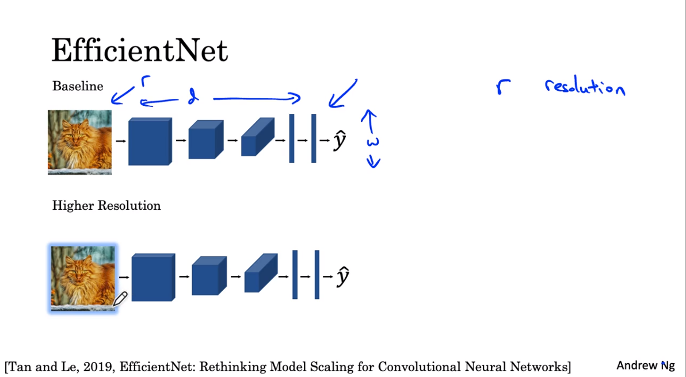
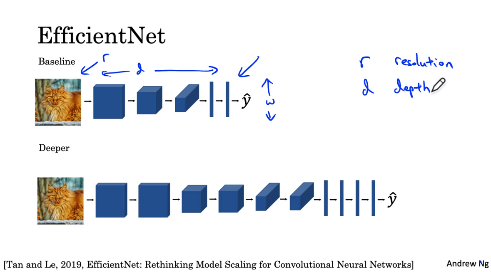
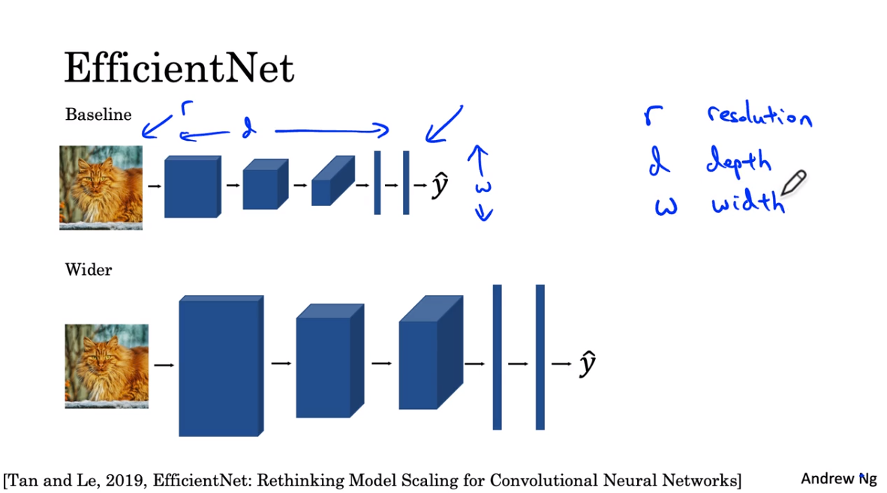

Khi làm việc với mobile devices hay các edge devices chúng có tài nguyên khác nhau. Do đó nếu muốn triển mạng NN để thực hiện một số bài toán lên các thiết bị này chúng ta phải tìm cách scale up hay scale down model cho phù hợp với tài nguyên thiết bị. EfficientNet sẽ giúp chúng ta điều này.

Chúng ta có `baseline model` với các thông số `resolution, depth of NN hay width of layers`.

Có thể thay đổi resolution.

Thay đổi depth of NN.

Thay đổi width of layers. 

Hoặc có thể thay đổi đồng thời các thông số trên hãy đọc EfficientNet để tìm hiểu thêm.
