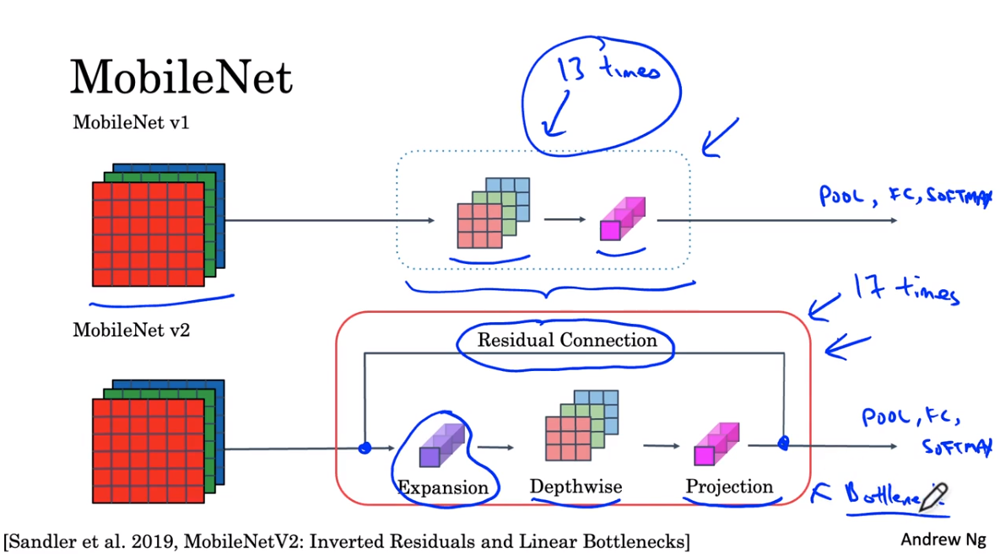

# MobileNet
Tính toán nhẹ hơn, có thể triển khai trên các thiết bị di động.

## Motivation for MobileNets
* Chi phí tính toán thấp khi deployment
* Hữu ích cho các ứng dụng di động và hệ thống nhúng
* Key idea: Normal and depthwise-separable convolutions

## Normal convolution

Giả sử có ảnh `6x6x3`, áp convolution layer vào filter có kích thước `3x3x3` với 5 filters. Khi đó computional cost sẽ được tính như trên  (gần đúng). Mỗi filter có số parameters là `3x3x3` (mỗi lần tính sẽ tính 27 phép tính rồi cộng lại). Filter này di chuyển tất cả `4x4` lần để tạo output. Nên nhớ có 5 filters nên cần nhân thêm với 5. Đây mới chỉ là tính toán cho một ảnh cực kỳ nhỏ. 

## Depthwise Seperable Convolution
Có 2 steps: depthwise convolution + pointwise convolution

### Depthwise convolution

Ảnh ban đầu `n x n x n_C`, kích thước của filter là `f x f x n_C`. Tuy nhiên khác với `normal convolution` ở `depthwise convolution` sẽ thực hiện convolution operation trên mỗi channels `n x n` của ảnh, và filter là `f x f`. Khi đó sẽ thực hiện `n_C` lần. Đầu ra sẽ được output với số channels là `n_C`.

Cùng xem chi tiết từng channel một.

Đối với the first filter.

Đối với the second filter.

Đối với the third filter.

Nhận thấy ouput có kích thước là `n_out x n_out x n_C`.

Trên đây là computational cost cho `depthwise convolution`, lúc này chỉ còn `(3 x 3) x (4 x 4) x 3`. Ở đây 3x3 là số phép tính cho một ví trí của output (1 channel), có 4 x 4 vị trí cho 1 channels và tổng cộng có 3 channels.

### Pointwise convolution

Pointwise vonvolution - áp dụng `1x1` convolution, khi đó có thể thay đổi số channels of output tùy ý. Kích thước heigh x width đã được xác định ở bước `depthwise convolution` rồi nên không cần lo lắng nữa. Nhận thấy dễ dạng tính được computational cost cho pointwise convolution.

## Cost summary
So sánh computational cost của normal convolution và depthwise seperable convolution.

Bên trái là công thức tổng quát so sánh computational cost của depthwise seperable convolution với normal convolution. Nói chung `depthwise seperable convolution` nhanh hơn khoảng 10 lần so với `normal convolution`.

Chú ý về cách biểu diễn. Filter ở phần depthwise và pointwise convolution không biểu diễn chính xác số channels (chỗ này chỉ biểu diễ tượng trưng thôi).

# MobileNet Architecture

Ý tưởng của MobileNet là các chỗ ngày xưa dùng `normal convolution` thì bây giờ chuyển sang `depthwise seperable convolution`. 
MobileNet v1 với `13` lần lặp lại của `depthwise seperable convolution, theo sau đó là `Pooling, FC, Softmax`.

MobileNet v2 có cải tiến hơn. Có 2 sự thay đổi chính:
* Add residual connections
* Có thêm expansion layer phía trước depthwise convolution và pointwise convolution (trong này gọi là `projection` vì một số lý do).

Block của version 2 lặp lại 17 lần, mỗi block gọi là `bottle block`.

## Mobilenet v2 Bottelneck

Trong `bottelneck block` input vừa được truyền qua `residual connection` và được đưa vào `expansion layer` (chỗ này vẽ kết nối sang residual connection dễ gây hiểu nhầm).
Expansion layer sử dụng Convolutional layer với filter `1 x 1 x n_C`, lúc này số filters thường lớn hơn số channels của input nên được gọi là `expansion layer`.

Sau đó đi qua `depthwise convolution`. Ở đây có áp dụng padding='same' nên kích thước width và height không đổi.  

Ở bước cuối là `pointwise convolution` hay còn gọi là `projection`. Nhìn vào hình sẽ thấy từ `n x n x 18` xuống `n x n x 3` nên gọi là `projection`. 

**Bottleneck block** hoàn thành 2 nhiệm vụ: 
* Sử dụng `expansion layer` nó tăng kích thước biểu diễn ở trong bottleneck block. Điều này cho phép NN học được `richer function` (thêm nhiều filters có thể học được các features khác nhau từ data). Tuy nhiên đoạn này rõ ràng có thêm một chút tính toán.
* Tuy nhiên ngay sau `depthwise convolution` là `pointwise convolution` giúp giảm kích thước biểu diễn xuống, tính toán sẽ không bị quá nhiều.

Chính vì 2 điều trên mà MobileNet v2 có hiệu năng tốt hơn MobileNet v1. 

