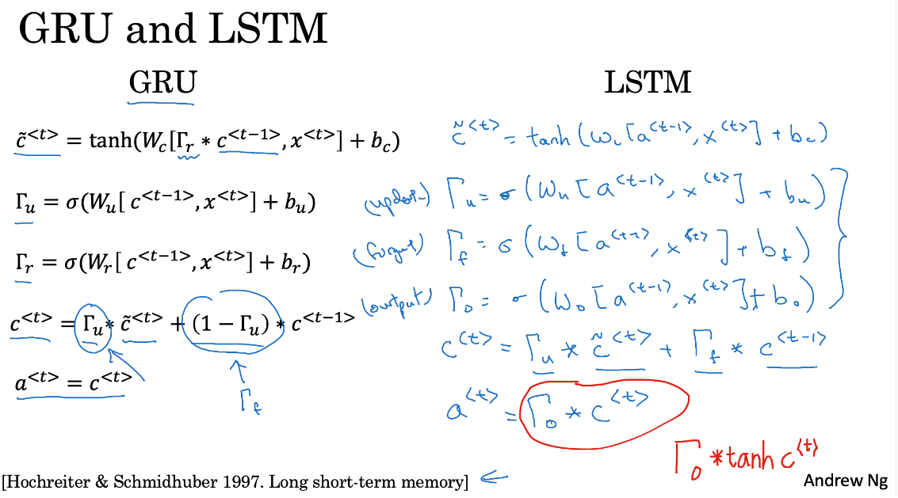

\usepackage[hybrid]{markdown}

Bài này sẽ viết lại những gì học được về Course "Sequence Models" week1 trên Coursera

# 1. Why sequence models? Tại sao là mô mình chuỗi
Sequence models là một trong các phần hấp dẫn nhất của Deep Learning. Models như RNN thực hiện nhận diện giọng nói (speech recognition). Hãy xem một số ứng dụng của sequence models:
- Speech recognition: input là audio clip, output là text transcript (cả input và output đều là sequence data - dữ liệu dạng chuỗi, audioclip được chơi theo thời gian, text là chuỗi các từ)

- Music generation cũng là một vấn đề với sequence data. Trong trường hợp này chỉ có output `Y` là sequence. Input có thể trống hoặc có thể là số nguyên nào đó chỉ loại nhạc (genre) bạn muốn tạo ra hoặc một số nốt nhác của đoạn nhạc muốn tạo ra.

-  Sentiment classification (phân loại quan điểm): input là một sequence (ví dụ một câu nhận xét bộ phim chẳng hạn), output có thể là các số từ 1 đến 5 chỉ sự hài lòng với bộ phim

- DNA sequence analysis (phân tích chuỗi DNA): DNA được biểu diễn bằng các chữ cái A, C, G, T, cho một chuỗi DNA chúng ta có thể gán nhãn phần nào của chuỗi DNA tương ứng với mã protein

- Machine translation (dịch máy): dịch từ ngôn ngữ này sang ngôn ngữ khác, cả input và output đều ở dạng sequence

- Video activity recognition (nhận diện hành động trong video): input là sequence of video frames, yêu cầu cần nhận diện hành động trong các frames đó

- Name entity recognition (nhận diện thực thể có tên): Ví dụ input là một câu và cần xác định đâu là tên người trong câu đó. 

Tất cả các bài toán trên đầu có thể giải quyết như supervised learning (học giám sát). Nhận thấy example X và label Y có thể là các loại sequence khác nhau, độ dài có thể khác nhau, có trường hợp chỉ X hoặc Y là sequence

# 2. Notation - Ký hiệu
## Motivatiing example
Cùng xem ví dụ về `Name entity recognition`: tìm tên người ở trong câu (phụ vụ cho mục đích tìm kiếm, sau này mở rộng ra có thể tìm kiểm tên quốc gian, tên công ty, thời gian, địa điểm và nhiều loại khác nữa).

Cho đầu vào x: `Harry Potter and Hermione Granger invented a new spell`
Đầu ra y: `1 1 0 1 1 0 0 0 0`

Đầu ra sẽ chỉ cho chúng ta biết vị trí của từ là một phần của tên người (các vị trí có số 1). Thực tế thì cách biểu diễn output Y như này không phải là cách biểu diễn tốt nhất, có các cách biểu diễn khác còn cho chúng ta biết khi nào bắt đầu tên người và khi nào kết thúc tên người trong câu. Ví dụ bắt đầu bằng `Harry` và kết thúc là `Potter`, bắt đầu bằng `Hermione` và kết thúc bằng `Granger`.

Input là sequence với 9 từ, chúng ta có 9 features tương ứng với 9 từ này. Sử dụng các index trong angle bracket `<i>` để chỉ vị trí các từ trong câu X<1> ... X<9>. Tương tự cới output chúng ta cũng có Y<1> ... Y<9>.

Tx - độ dài của chuỗi đầu vào (legth of the input sequence), Tx = 9
Ty - độ dài của chuỗi đầu ra, Ty = 9
Tx, Ty trong các bài toán có thể khác nhau không nhất thiết phải bằng nhau.

Mỗi example được kí hiệu là X(i), do đó từ ở vị trí `t` trong example `i` được kí hiệu là X(i)<t> $X^{(i)<t>}$, độ dài của example X(i) là $T_{x}^{(i)}$.

Tương tự như vậy ta cũng có cho output $X^{(i)<t>}$, $T_{y}^{(i)}$.

## Representing words - Biểu diễn các từ
Để biễn diễn word đầu tiên sẽ xây dựng `vocabulary` - list of the words. Ví dụ có covabulary có size = 10000 chẳng hạn.
Đối với các ứng dụng thực tế `vocab_size` thường từ 30000 đến 50000. Tuy nhiên có một số nơi sử dụng đến hàng triệu từ. 

Một cách để xây dựng `vocabulary` là lấy từ training set 10000 từ hay gặp nhất (the most occcuring words). Sau đo sử dụng `one-hot vector` để biểu diễn các từ. Mỗi từ X<t> được biểu diễn biễn bởi one-hot vetor có `dimension = 10000`.

# 3. Recurrent Neural Network
## Vì sao không phải là mạng Neural Network thông thường

Như bài trước input có 9 units tướng ứng với 9 words. Hình bên trên biểu diễn mạng NN thông thường. Tuy nhiên dường như mạng NN thường không hoạt động tốt đối với bài toán sequence models. Có 2 vấn đề chính như sau:
- Inputs và outputs có thể có các kích thước khác nhau đối với các examples và labels khác nhau. Nếu sử dụng padding để cho input hoặc output có cùng độ dài đối với các dataset khác nhau nhưng đây cũng không phải là lựa chọn tốt.
- Cấu trúc mạng bên trên không chia sẻ các features học được ở các vị trí khác nhau. Ví dụ một từ ở vị trí này có thể liên quan đến 1 từ ở vị trí khác. Nếu sử dụng mạng NN thông thường thì không làm được như vậy. 

Lựa chọn biểu diễn tốt cũng làm giảm số lượng parameters. Mỗi từ được biểu diễn bằng one-hot vector có dimensions 10000. Do đó input layer rất lớn, weights matrix cho layer 1 rất lớn. Để tránh tất cả các nhược điểm trên mạng RNN đã được ra đời.

## Recurrent Neural Networks
- Các câu được đọc từ trái qua phải, ví dụ từ đầu tiên đọc được là X<1>. Cho từ X<1> vào neural network layer. Đó là hidden layer of the first neural network. Đầu ra cố gắng dự đoán nó có phải là một phần của tên người hay không. 
- Mạng RNN tiếp tục đọc đến chữ thứ 2 X<2>, thay vì dự đoán y<2> chỉ dựa vào X<2> nó còn sử dụng thông tin từ timestep 1 để làm đầu vào input. Cụ thể hơn, `activation value` từ timestep 1 được đưa vào timestep 2. 
- Cứ tương tự như vậy cho đến last timestep `Tx` với từ X<Tx> và output là y<Ty>. Ở đây Tx và Ty bằng nhau. (Thực tế Tx, Ty có thể khác nhau)
- Để thuận tiện hơn sau này ta cũng thêm activation at zero timestep `a<0>' để đưa vào input của timestep 1. `a<0>` thường là vector of zeros.

Mạng RNN đi từ trái sang phải của dữ liệu. Các parameters nó sử dụng tại mỗi timestep được dùng chung (share) với nhau. 
- Parameters kiểm soát kết nối từ X^{<1>} đến hidden layer là $$ W_{ax} $$, tại các timestep khác cũng vậy
- Các kết nối ngang (horizontal connection) được kiểm soát bởi parameters $$ W_{aa} $$
- Tương tự như vậy $$ W_{ya} $$ kiểm soát kết nối đến prediction tại các tiemstep

**Chú ý**: Khi dự đoán $$ \hat{y}^{<3>} $$ không chỉ lấy thông tin từ $$ X^{<3>} $$ mà còn lấy thông tin từ $$ X^{<1>} $$, $$ X^{<2>} $$. Đây cũng có thể coi là nhược điểm của RNN do nó chỉ lấy được thông tin trước đo, còn thôn tin phía sau (từ phía sau) lại không được sử dụng để dự đoán từ hiện tại. Ví dụ khi dự đoán $$ X^{<3>} $$ không sử dụng được thông tin từ $$ X^{<4>} $$...

**Ví dụ**: Đối với câu `He said, Teddy Roosevelt was a great President`.
Nếu ta biết được thông tin từ phía sau `Roosevelt` thì có thể dễ dàng xác định được `Teddy` là một phần của tên người (hai từ phía trước có rất ít thông tin)
Đối với câu `He said, Teddy bears are on sale!`. Nhìn vào hai câu này, nếu chỉ biết 2 từ đầu tiên thì gần như không phân biệt được từ tiếp theo 

Vấn đề này sẽ được giải quyết với Bi-directional Recurrent Neural Network (BRNN).

## Forward propagation

Thường cho $$ a^{<0>}=\vec{0} $$.
Forward propagation

Wax: chỉ số thứ 2 `x` có nghĩa rằng Wax được nhân với x, chỉ số đàu tiên `a` chỉ đại lượng được tính.

**Chú ý**: activation functon để tính  $$ a^{<1>} $$ có thể là tanh/Relu. Activation function để tính $$ \hat{y}^{<1>} $$ có thể là `sigmoid` (2 classes) hay `softmax` (nhiều hơn 2 classes). Đối với bài toán `name entity recognition` activation function để tính output là `sigmoid`.

Công thức tổng quát hơn để tính activation $$ a<t> $$ và \hat{y}^{<t>}

Để đơng gian hóa kí hiệu này chúng ta có thể thực hiện như sau. 

Ví dụ a là vector 100 dimensions, X là vector 10000 dimensions. Khi đó ma trận Waa có size là  (100, 100)
, ma trận Wax có size là (100, 1000). Do vậy có thể stack 2 ma trận này theo hàng ngang được ma trận Wa. a<t-1> và x<t> được xếp theo chiều dọc với nhau do a<t-1> có size (100, 1), x<t> có size là (10000, 1)

# 4. Backpropagation through a time
Xem thêm về backpropagation
https://mmuratarat.github.io/2019-02-07/bptt-of-rnn

# 5. Different types of RNN

# 6. Language model and sequence generation

# 7. Sampling novel sequences

# 8. Vanishing gradients with RNNs

Tham khảo thêm bài này
https://towardsdatascience.com/the-exploding-and-vanishing-gradients-problem-in-time-series-6b87d558d22

http://www.cs.toronto.edu/~rgrosse/courses/csc321_2017/readings/L15%20Exploding%20and%20Vanishing%20Gradients.pdf

https://nickmccullum.com/python-deep-learning/vanishing-gradient-problem/

# 9. Gated Recurrent Unit (GRU)

GRU là phiên bản nâng cấp của RNN giúp tránh vanishing gradient.

Trong RNN chuẩn hidden state được tính như sau:

$$a^{<t>} = g(W_a[a^{<t-1>}, x^t] + b_a)$$

ở đây đã rút gọn, có thể viết tường minh như sau:

$$a^{<t>} = g(W_{aa}a^{<t-1>}, W_{ax}x^t + b_a)$$

trong đó activation function $g$ thường dùng là hàm $tanh(x)$. Trong một số tài liệu thường thay $a$ bằng $h$ và gọi đó là hidden state.

2 bài báo chính ảnh hưởng đến GRU là :
https://arxiv.org/abs/1409.1259
https://arxiv.org/abs/1412.3555

**GRU (simplified)**

**The *cat*, which already ate..., *was* full**. Trong câu này làm sao có thể nhớ được từ **cat** là danh từ số ít để điền **was**. GRU đưa vào varable mới $c$ gọi là **memory cell**. Gọi tên là như vậy vì bản chất của nó giúp ghi nhớ thông tin ở các time step phía trước. 

Đối với time step $t$ ta có $c^{<t>} = a^{<t>}$. Giá trị của merory cell bằng với giá trị của activation function tại hidden layer của time step đó.

Tại mỗi time step chúng ta sẽ quan tâm đến giá trị:

$$\widetilde{c}^{<t>} = tanh(W_c[c^{<t-1>}, x^{<t>}] + b_c)$$

$\widetilde{c}^{<t>} $ là ứng viên để thay thế $c^{<t>}$.

Tương tự như các phần trước $W_c$ là matrix được hình thành từ việc xếp hàng ngang 2 matrix $W_{cc}$ và $W_{cx}$. $[c^{<t-1>}, x^{<t>}]$ được hình thành từ việc xếp dọc $c^{<t-1>}$ và $x^{<t>}$ do chúng đều là 2 vectore cột (nếu chỉ coi có 1 ví dụ - để hiểu đơn giản).

Ý tưởng chính của GRU là gate:

$$\Gamma_u = \sigma(W_u[c^{<t-1>}, x^{<t>}] + b_u) $$

trong đó $\Gamma_u$ được gọi là updeted gate có giá trị thuộc $[0, 1]$ nó thể hiện cho việc có update hay không (ví dụ với vị trí một từ trong câu tính được $c^{<t>}$, khi đến một vị trí giá trị này được sử dụng vì chúng có thể liên quan đến nhau, lúc này ta sẽ update chúng và quên đi), $\sigma $ - hàm sigmoid.

$$c^{<t>} = \Gamma_u \ast \widetilde{c}^{<t>} +  (1- \Gamma_u) \ast {c}^{<t-1>}$$

- nếu $\Gamma_u = 1$ thì $c^{<t>} = \widetilde{c}^{<t>} $
- nếu $\Gamma_u = 0$ thì $c^{<t>} = {c}^{<t-1>} $. Điều này có nghĩa rằng không update gì cả.

Cùng xem GRU unit bên dưới để thấy rõ hơn. $c^{<t-1>}=a^{<t-1>}$ đi vào kết hợp với $x^{<t>}$ để tính được $\widetilde{c}^{<t>}$ và $\Gamma_u$. Kết hợp $c^{<t-1>}$, $\widetilde{c}^{<t>}$ và $\Gamma_u$ chúng ta tính được $c^{<t>}=a^{<t>}$ (tất nhiên tính luôn cả prediction nếu cần nếu chỉ có một hidden layer). Sơ đồ này khá là dễ hiểu.

Nhận thấy $c^{<t>}$, $\widetilde{c}^{<t>}$ và $\Gamma_u$ là vector có cùng shape (ví dụ cho 1 example đó). Nên nhớ trong phần tính $c^{<t>}$ chúng là có element-wise multiplication.

**GRU (full)**

$$\widetilde{c}^{<t>} = tanh(W_c[\Gamma_r \ast c^{<t-1>} + c^{<t-1>}, x^{<t>}] + b_c) ~~~~~~~~(1)$$

$$\Gamma_u = \sigma(W_u[c^{<t-1>}, x^{<t>}] + b_u) $$

$$\Gamma_r = \sigma(W_r[c^{<t-1>}, x^{<t>}] + b_r) $$

$$c^{<t>} = \Gamma_u \ast \widetilde{c}^{<t>} +  (1- \Gamma_u) \ast {c}^{<t-1>}$$

Trong (1) thêm $\Gamma_r\ast c^{<t-1>}$ để thể hiện ảnh hưởng của $c^{<t-1>}$ đến $\widetilde{c}^{<t>}$

# 10. Long Short Tẻrm Memory (LSTM)
Trong bài trước đã học về GRU (Gated recurrent unit) cho phép chúng ta có khoảng kết nối dài (tránh được vanishing gradient). Cũng có một loại unit khác làm điều này cũng rất tốt đó là LSTM unit. LSTM còn mạnh mẽ hơn cả GRU.
 
$$c^{t}$$ tidle là ứng viên để thay thế $$ c^{t} $$. Gamma u sẽ quyết định thay thế hay không. 

LTMS mạnh mẽ hơn GRU một chút là và phiên bản tổng quát hơn GRU. GRU chỉ có Gamma u kiểm soát việc thay thế, trong LSTM có 2 đại lượng là Gamma u và Gamma f (forget) kiểm soát việc này. Ở LSTM này có thêm Gamma o (output)

LSTM có 3 gates (update, forget và output) phức tạp hơn so với GRU.  

Đây là các phương trình cho một unit của LSTM, nhớ rằng output ở mỗi unit y<t> được xác định từ a<t> nhé (ở đây không ghi nhưng mình cần hiểu như vậy).

Đây là sơ đồ kết nối trong một mạng LSTM hoàn chỉnh.

Hãy cùng xem kết nối phía trên được tô đỏ.

Đường màu đỏ này thể hiện các `update gate` và `forget gate` (`output gate` không có vì output gate quản lý đầu ra ở mỗi unit thôi. Nhìn vào hình ban đầu là thấy). Do đó nếu thực hiện một cách hợp lý hoàn toàn có thể cho gía trị c<3> lặp lại giá trị c<0> được. Đây chính là lý do khiến LSTM và GRU nhớ rất tốt giá trị trong thời gian dài - lưu giá trị trong memory cell (có thể tránh được vanishing gradient và có được sự ảnh hưởng dài - các từ ở xa có thể ảnh hưởng đến các từ khác).

Có một số biến thể khác của LSTM, ví dụ thay vì các gate phụ thuộc vào mỗi a<t-1> và x<t>, có thể cho các gates phụ thuộc thêm vào  c<t-1> - previous memory cell value và người ta gọi đó là `peephole connection`. `Peepphole connection` có thể được đưa vào tính toán cả 3 gates.

**Chú ý**:
- LSTM phức tạp hơn, có 3 gates nhưng mạnh mẽ hơn
- GRU có 2 gates, đơn giản hơn và dễ xây dựng biggef network hơn

Ngày nya mọi người hay sử dụng LSTM tuy nhiên gần đây một số nhóm có sử dụng GRU và đạt được những kết quả rất tốt.

**Kết luận**: Từ mạng RNN cơ bản đầu vào là từ ở timestep <t> và information ở trước đó để dự đoán đầu ra, GRU và LTSM có bổ sung thêm memory cell để có thể lưu giá trị từ trước đó giúp tránh được vanishing gradient và giữ được ảnh hưởng xa của các từ (far dependencies).

# 11. Bidirectional RNN
Trong các bài trước chúng ta đã thấy các building block của mạng RNN cơ bản và GRU, LSTM. Còn 2 ý tưởng có thể làm cho mạng mạnh mẽ hơn:
- Bidirectional RNNs
- Deep RNNs

Để hiểu rõ hơn cùng xem mạng RNN với bài toán name entity recognition (tìm từ nào là một phần của tên người).

Nhìn vào ví dụ trên để xác định `Teddy` có phải là một phần của tên người hay không, việc nhìn vào 2 từ phía trước là không đủ. Đây chính là **unidirectional or forward directional RNN**. Nhận xét này đều đúng cho dù unit vuông là RNN, GRU hay LSTM. Tất cả các blocks này đều theo forward direction. Vậy `Bidirectional RNN` làm gì?

Cùng xem ví dụ câu có 4 từ x<1>, x<2>, x<3>, x<4> và các forward recurrent components (các thành phần lặp lại theo chiều xuôi - có mũi tên trên đầu activation để chỉ chiều).

Sau đó chúng ta sẽ thêm vào `backwrad recurrent layer` với chiều mũi tên ngược lại.

Backward connections sẽ kết nối các backward hiddenr layer the chiều ngược lại. Network này xác định Acyclic graph. 

