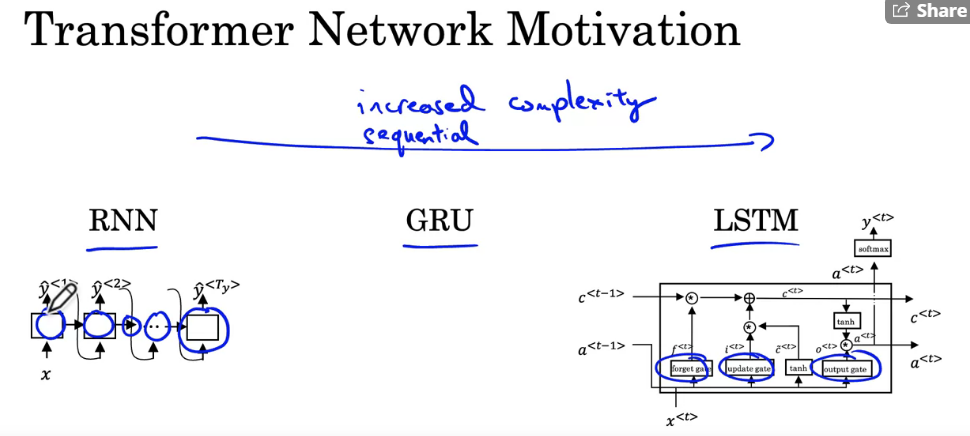
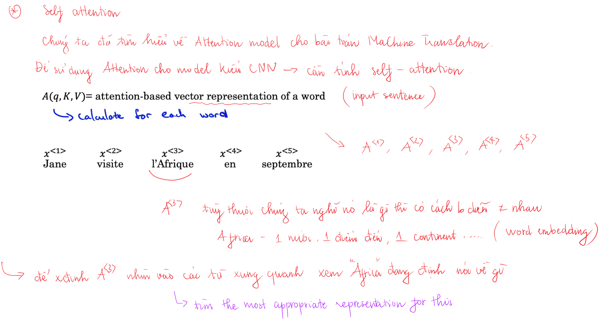
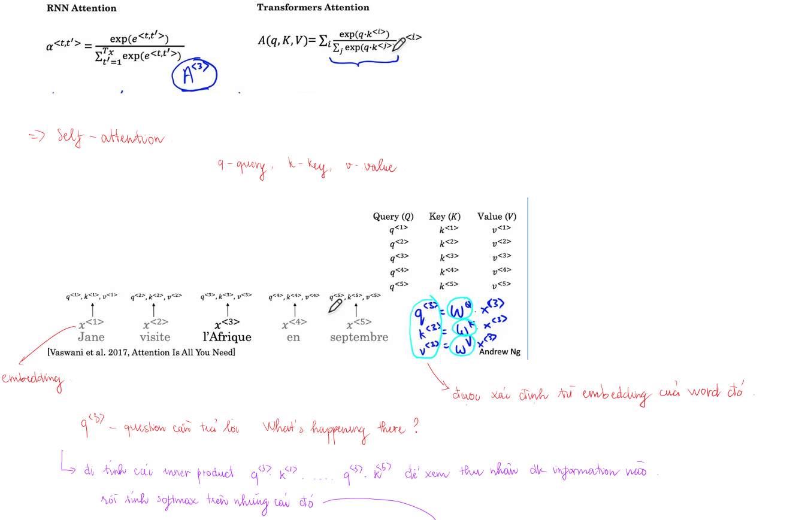
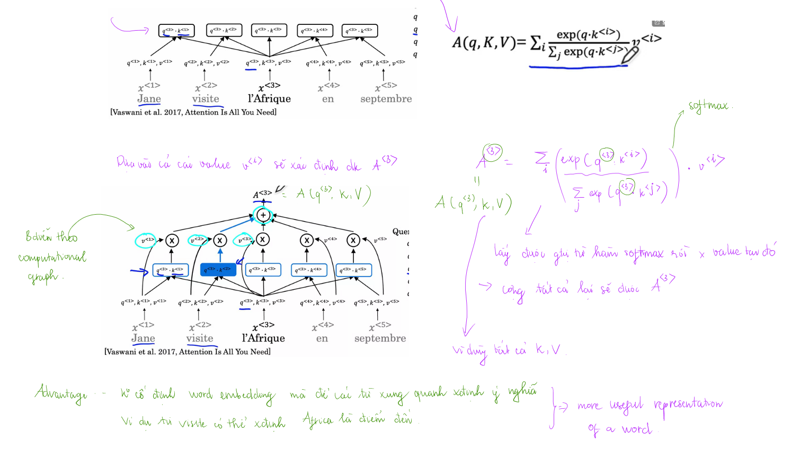
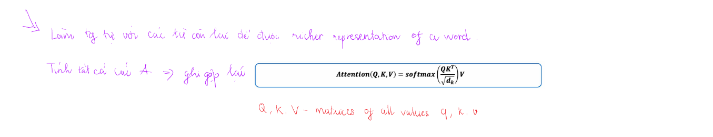
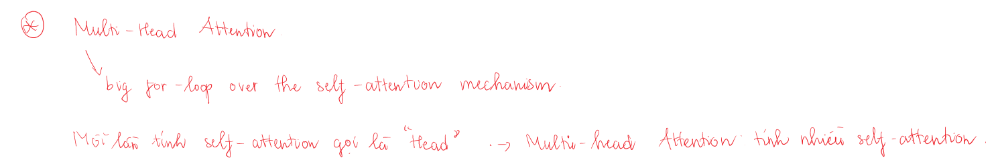
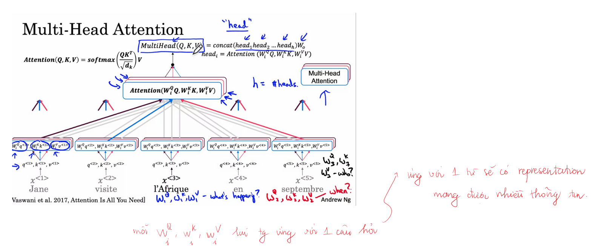
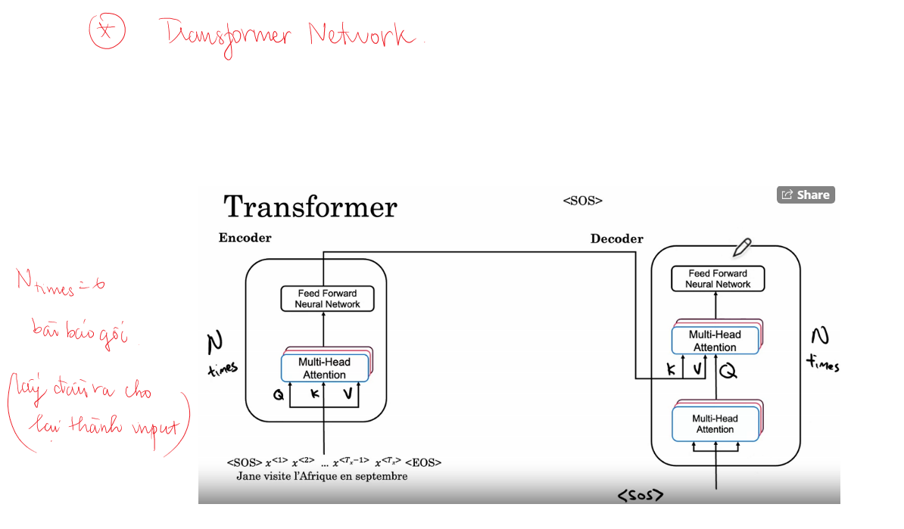
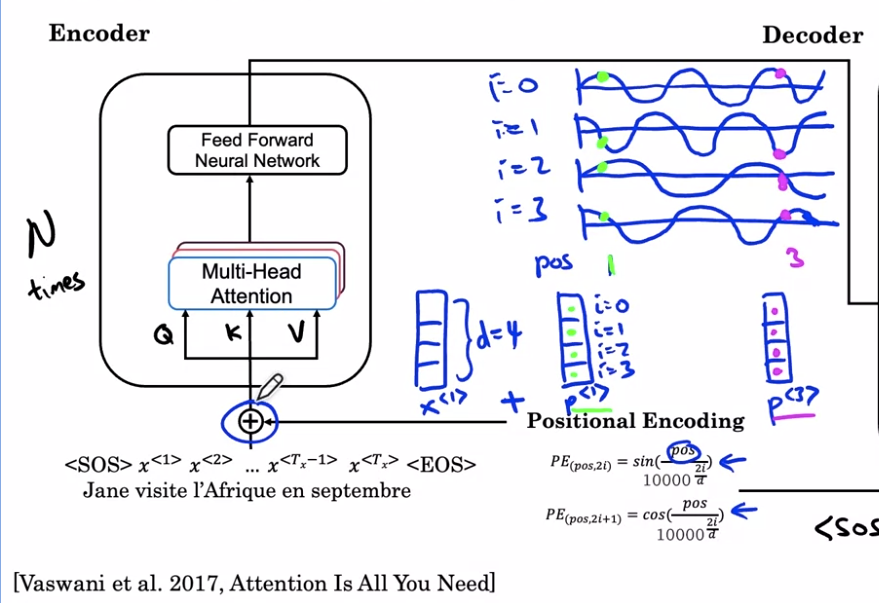
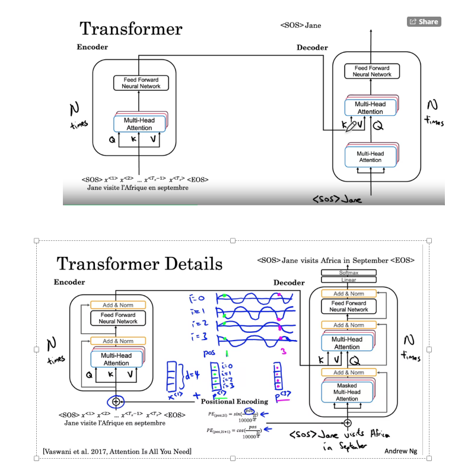

## Transformer Network Intuition

**Transformer network movivation**

Các mô hình từ RNN đến GRU rồi LSTM ngày càng phức tạp và tăng độ tính toán lên nhieuf lần. Chúng ta bắt đầu với RNN và nó có vấn đề với vanishing gradient, rất khó để nắm bắt được sự phụ thuộc khi cacsc từ xa nhau. Sau đó GRU, LSTM với các gates đã chúp chúng ta kiểm soát được luồng thông tin, tuy nhiên độ phức tạp cũng tăng lên. Tất cả model kể trên đều là sequential models. Để xác định được những unit phía sau cần phải xác định được unit phái trước, điều khiến khiến thời gian training khá lâu. Transformer architecture ra đời giúp chúng ta giải quyết vấn đề này, nó có thể thực hiện nhiều tính toán song song hay có thể xử lý cả câu tạo một thời điểm thay vì xử lý từng từ.

Sự đổi mới lớn trong Transformer architecture là nó kết hợp giữa attention based representation và CNN. Bình thường CNN ghi dự đoán nó phải thực hiện lần lượt, điều này trái ngược với CNN có thể tính toán song song được. Có 2 ý tưởng chính trong attention network là: **self-attention và multi-head attention.**

Mục đích của self-attention là nếu chúng ta có sentence với 5 words, chúng ta sẽ tính được 5 representations $A^{<1>}...A^{<5>}$ cho 5 từ đó. Đây là cách biểu diễn dựa trên attention cho tất cả các từ trong câu. Sau đó multi-head attention là vòng for cơ bản sẽ lặp qua quá trình self-attention. Do đó chúng ta sẽ kết thúc với nhiều versions của các biểu diễn trên. Kết quả là những biểu diễn đó là những biểu diễn rất phong phú có thể được sử dụng cho machine translation hay các ứng dụng NLP khác để tạo ra hiệu quả.

## Self Attention

Chúng ta đã thấy cách sử dụng attention trong sequential NN như RNN (trong bài về machine translation khi tạo từ dịch sẽ để ý đến các phần của câu), tuy nhiên để sử dụng cơ chế attention trong style CNNs chúng ta cần tính toán **self-attention**, ở đây chúng ta tạo ra các attention-based representations cho mỗi từ trong input sentence. 

Input sentence: *Jane visite l'Afrique en septembre*

Mục đích của chúng ta là đối với mỗi từ trong input sentence chúng ta sẽ xác định *attention-based representation* $A(q, K, V)$. Input sentence có 5 từ do đó chúng ta có $A^{<1>}...A^{<5>}$.

Chúng ta sẽ tìm hiểu các **self-attention** cho phép chúng ta tính toán attention-based representation của các từ trong input sentence. Trước đó chúng ta đã học về word embedding. Ví dụ một cách để biểu diễn từ *l'Afique* là sử dụng word embedding của nó. Nhưng phù thuộc vào hoàn cảnh chúng ta sẽ nghĩ về *l'Afique* như một địa điểm du lịch, một nước, một continent... Phụ thuộc vào cách bạn nghĩ về *l'Afique* bạn có thể lựa chọn các cách biểu diễn khác nhau cho $A^{<3>}$. Nó sẽ nhìn vào các từ xung quanh xem chúng ta đang nói đến *l'Afique* là cái gì rồi tìm cách biểu diễn thích hợp nhất cho từ đó. Về tính toán thực tế nó không khác lắm so với attention mechanism được áp dụng trong bài toán machine translation đã tìm hiểu trước đó. Điểm khác duy nhất ở đây là chúng ta tính toán biểu diễn cho các từ song song cùng một lúc. Nhớ lại attention mechanism chúng ta tính toán điều này lần lượt bởi vì phải biết các hidden state của cell trước. Trước đây chúng ta xây dựng attention mechanism on top of the RNN, attention weights có công thức như này:

$$\text{RNN attention:} ~~~~~\alpha^{<t,t'>} = \frac{\text{exp}(e^{<t, t'>})} {\sum_{t'=1}^{T_x} \text{exp}(e^{<t, t'>})}$$

Tuy nhiên với self-attention mechanism chúng ta có attention equation như sau:

$$\text{Transformers attention:} ~~~~~ A(q, K, V) = \sum_{i} \frac{\text{exp}(q \cdot k^{<i>})} {\sum_{j} \text{exp}(q \cdot k^{<j>})} v^{<i>} ~~~~~~(1) $$

Công thức này khá tương đồng với công thức trên, phần số đầu tiên là hàm softmax, có thể coi $q \cdot k^{<i>}$ như attention value. Sự khác biệt chính ở đây là đối với mỗi từ chúng ta có 3 values, ví dụ cho từ *l'Afique* chúng ta có $q^{<3>}$, $k^{<3>}$, $v^{<3>}$. Đây là những inputs để tính được transformers attention cho từng từ.

Thử lấy ví dụ với từ thứ ba *l'Afique*, chúng ta sẽ đi tính attention-bases representation cho nó:
- Đầu tiên chúng ta liên kết từng từ với 3 giá trị tương ứng của nó là $q^{<t>}$, $k^{<t>}$, $v^{<t>}$ (query, key, value pair)

| Query (Q)   | Key (K)     |   Value (V) |
| ----------- | ----------- | ----------- |
| $q^{<1>}$   | $k^{<1>}$   | $v^{<1>}$   |
| $q^{<2>}$   | $k^{<2>}$   | $v^{<2>}$   |
| $q^{<3>}$   | $k^{<3>}$   | $v^{<3>}$   |
| $q^{<4>}$   | $k^{<4>}$   | $v^{<4>}$   |
| $q^{<5>}$   | $k^{<5>}$   | $v^{<5>}$   |

- Ví dụ $x^{<3>}$ là **word embedding** cho từ *l'Afique*. Các giá trị $q^{<3>}$, $k^{<3>}$, $v^{<3>}$ được tính dựa vào các **learned matrices** $W^q$, $W^k$, $W^v$.

$$q^{<3>} = W^q \cdot x^{<3>}$$
$$k^{<3>} = W^k \cdot x^{<3>}$$
$$v^{<3>} = W^v \cdot x^{<3>}$$

$W^q$, $W^k$, $W^v$ coi là parameters học được từ algorithm, tên của chúng lấy ý tưởng từ database: query (câu truy vấn), key-value (cặp key và kết quả trả về).

Query $q^{<3>}$ là một câu hỏi bạn cần hỏi về *l'Afique* như điều gì đang xảy ra ở đó. Khi tính $A^{<3>}$ chúng ta muốn biết điều gì đang xảy ra ở đó. 
    - Tính inner product (tích vô hướng) $q^{<3>} \cdot k^{<1>}$. Nó sẽ nói chúng ta ta biết câu trả lời tốt như thế nào cho câu hỏi trên
    -  Tính với $k^{<2>}$ của từ thứ hai $q^{<3>} \cdot k^{<2>}$. Từ *visite* sẽ giúp chúng ta trả lời về điều gì đang xảy ra với *l'Afique*. Nói tóm lại từ tương ứng với key $k^{<t>}$ có thể cho chúng ta thêm thông tin về *l'Afique*.
    - Làm tương tự với tất cả các từ còn lại kể cả chính từ đó.

Mục đich của điều này là lấy ra được nhiều thông tin nhất để xác định được useful representation (biểu diễn hữu ích) $A^{<3>}$.

Điều sau này chỉ để cho mình có cảm giác hơn về cơ chế. Ví dụ $k^{<1>}$ biểu diễn từ đó là người, $k^{<2>}$ biểu diễn từ đó là hành động... Khi tính có thể thấy $q^{<3>} \cdot k^{<2>}$ nhận giá trị lớn nhất trong số đó. Điều này có nghĩa rằng từ *visite* có nhiều hoàn cảnh liên quan nhất đến *l'Afique*. Nến có thể suy ra *l'Afique* là một địa điểm tham quan chẳng hạn. Đây chỉ là một cách giúp chúng ta dễ hình dung hơn.

- Tính softmax cho các inner product bên trên (tương ứng với $\frac{\text{exp}(q \cdot k^{<i>})} {\sum_{j} \text{exp}(q \cdot k^{<j>})}$). Nên nhớ ở đây chỉ có một giá trị $q^{<3>}$ được sử dụng do đang đi tính $A^{<3>}$.
- Nhân lần lượt các giá trị softmax với các values $v^{<1>}$, $v^{<2>}$... (tương ứng với $v^{<i>}$)
- Cuối cùng cộng chúng lại với nhau (tương ứng với $\sum_{i}$) để nhận được $A^{<3>}$

Công thức (1) bên trên cho từ thứ 3 là:

$$A^{<3>} = A(q^{<3>}, K, V) = \sum_{i} \frac{\text{exp}(q^{<3>} \cdot k^{<i>})} {\sum_{j} \text{exp}(q^{<3>} \cdot k^{<j>})} v^{<i>} ~~~~~~(1) $$

Nhận thấy tính attention-bases representation cho từ nào thì trong công thức chỉ sử dụng query $q$ của từ đó, còn lại tất cả các giá trị $k^{<j>}$ và $v^{<i>}$ đều được sử dụng nên ghi là $K$ và $V$.

**Ưu điểm** chính của cách biểu diễn này là nó mỗi từ không có **word embedding cố định**. Tùy từng hoàn cảnh chúng ta sẽ có richer representation. 

Bên trên chúng ta đã tính $A^{<3>}$ làm ví dụ. Tương tự chúng ta có thể tính attention-based representation cho các từ còn lại. Nếu chúng ta đặt tất cả các tính toán này lại với nhau chúng ta có:

$$\text{Attention}(\mathbf{Q}, \mathbf{K}, \mathbf{V}) = \text{softmax}(\frac{\mathbf{Q} \mathbf{K}^T}{\sqrt{d_k}}) \mathbf{V}$$

trong đó $\mathbf{Q}$, $\mathbf{K}$, $\mathbf{V}$ là các ma trận chứa các vector $q{<t>}$, $k^{<t>}$, $v^{<t>}$ như bên trên (xem thêm xếp theo hàng hay cột)?).

$d_k$ -dimension of the key dùng để scale dot product để tránh nó quá lớn. Tên gọi khác cho attention này là **scaled dot-product attention**.

Chốt lại mỗi từ chúng ta có 3 giá trị query, key, value. Query như câu hỏi chúng ta cần đặt ra cho từ đó là gì... Keys của các từ khác cho phép chúng ta biết từ nào có liên quan nhất đến từ cần quan tâm (similarity, tính inner product). Cuối cùng value giúp chúng ta đưa những liên quan đó vào biểu diễn của từ (biểu diễn từ này phụ thuộc vào context chứ không phải cố định).

## Multi-Head Attention

Bài này chúng ta học về cơ chế multi-head attention, nó được hiểu đơn giản là vòng lặp for qua self-attention. Mỗi lần tính self-attention cho sequence được gọi là **head**. Tên gọi multi-head attention cũng ám chỉ điều đó (lặp lại self-attention nhiều lần).

Trong bài trước chúng ta đã tìm hiểu để có được các ma trận $Q$, $K$, $V$ chúng ta nhân các ma trận hệ số $W^q$, $W^k$, $W^v$ với các word embeddings. 

Đối với multi-head attention chúng ta cũng lấy các query, key, value của các từ làm inputs.
- Nhân ma trận hệ số với query, key, value của từ đó. $W_1^Q q^{<1>}$, $W_1^K k^{<1>}$, $W_1^V v^{<1>}$ cho từ thứ nhất. **3 giá trị này sẽ là bộ query, key, value mới cho từ đầu tiên**.
- Làm tương tự như vậy cho cho từ khác: $W_1^Q q^{<2>}$, $W_1^K k^{<2>}$, $W_1^V v^{<2>}$. Chúng ta có một attention.
- Chúng ta lặp lại quá trình trên nhiều lần cho các attention khác với ma trận hệ số khác.

Trong các tài liệu hay sử dụng $h$ để chỉ số lượng head được dùng. Các attentions đó có thể coi như richer representation của input sentence, sau đó có thể đưa nó qua các layer thông thường.

$$\text{Multihead}(Q, K, V) = concat(head_1, head_2, ..., head_n)W_0$$

trong đó $head_i = Attention(W_i^Q Q, W_i^K K, W_i^V V)$

Nhớ lại công thức cho attention:

$$\text{Attention}(\mathbf{Q}, \mathbf{K}, \mathbf{V}) = \text{softmax}(\frac{\mathbf{Q} \mathbf{K}^T}{\sqrt{d_k}}) \mathbf{V} ~~~(2)$$. 
Trong $head_i$ thì $W_i^Q Q, W_i^K K, W_i^V V$ có vai trò như $Q, K, V$ trong công thức số (2). Trong thực tế chúng ta có thể tính song song các heads được vì giá trị của chúng không phụ thuộc vào nhau, không phải tính tuần tự.

## Transformer Network

Input sentence: *Jane visite l'Afrique en septembre*

Cùng xem cách dịch câu trên từ tiếng Pháp sang tiếng Anh. Ở đây chúng ta có thêm vào *SOS* và *EOS* tokens để đánh dấu vị trí đầu câu và cuối câu (thấy sử dụng hữu ích).

Chúng ta có embeddings của các từ. Cho các embeddings này vào **encoder block**, nó có multi-head attention. Cái này giống với bài trước mình đã tìm hiểu. Các ma trận $Q$, $K$, $V$ được tính từ embeddings và các ma trận trọng số $W$. Multihead attention tạo matrix, sau đó được đưa vào Feead Forward Network, chúng ta sẽ nhận được features thể hiện cho input sentence. Trong bài báo gốc encoding block này lặp lại N lần ($N=6$). Sau các block này chúng ta nhận được output từ encoder, chúng ta sẽ cho nó vào decoder block. Nhiệm vụ của decoder block là đưa ra bản dịch tiếng Anh. Do đó output đầu tiên sẽ là start sentence token *SOS*.Ở mỗi bước decoder block sẽ nhận vào một số từ đã được tạo ra (các từ phía trước đã được dịch). Ban đầu chúng ta chỉ có *SOS* (start of sentence) thôi. *SOS* sẽ được đưa vào multi-head attention trong decoder block. *SOS* được sử dụng để tính $Q$, $K$, $V$ cho multi-head attention này. Đầu ra của multi-head attention block này được sử dụng để tính $Q$ cho multi-head attention block tiếp theo. Output của encoder (bây giờ mới được sử dụng) dùng để xác định $K$ và $V$ cho multi-head attention block thứ hai của decoder. Trực giá ở đây là $Q$ query đưa ra câu hỏi bắt đầu của câu là gì. Nó sẽ lấy context $K$, $V$ từ encoder để quyết định từ tiếp theo là gì. Output của multi-head attention được đưa qua Feed Forward NN. Block này cũng được lặp lại N lần (ví dụ 6). Mạng này có trách nhiệm dự đoán từ tiếp theo, ở đây hy vọng tìm được *Jane*. Khi đó chúng ta lấy *SOS*, *Jane* làm input của decoder block để xác định query $Q$. Làm tương tự cho các tự tiếp theo. Đây là ý tưởng chính của transofrmer.

Phần tiếp theo chúng ta sẽ xem một số cải tiến để giúp transformer hoạt động tốt hơn.

**Positional encoding of input**

Trong attention equation không có phần tử nào nói đến vị trí của các từ trong câu. Nên nhớ rằng vị trí của các từ trong input sentence có ảnh hưởng lớn đến ý nghĩa của câu cũng như đến việc dịch. Chúng ta cần có cách nào đó để đánh dấu và sử dụng các vị trí đó cho hợp lý. Có một cách để encode vị trí các từ là sử dụng các phương trình $sin$, $cos$.

$$PE_{(pos, 2i)} = sin(\frac{pos}{10000^{\frac{2i}{d}}})$$

$$PE_{(pos, 2i+1)} = cos(\frac{pos}{10000^{\frac{2i}{d}}})$$

trong đó $pos$ - numerical position của từ trong câu, ví dụ từ *Jane* có $pos=1$.
Ví dụ word embedding là vector có số chiều là $d=4$. Do đó chúng ta sẽ tạo ra positional emdbedded in vector có cùng số chiều với word embedding - gọi đó là positional encoding. $i$ ám chỉ các vị trí (chỉ số) trong positional encoding từ 0 đến $d-1$. Tương ứng với 2 công thức trên chúng ta có thể lấp đầy các giá trị cho positional encoding của từng từ.

Positional encoding có cùng số chiều với word embeđing nên chúng ta sẽ cộng 2 vector lại cho từng từ ở đầu vào (vừa chứa thông tin về vị trí vừa chứa thông tin về ngữ nghĩa).

Ngoài ra trong transformer còn sử dụng residual connection để tránh vanishing gradient, dễ training hơn. Transformer cungx sử dụng một loại layer gần giống với Batch Normalization đó là **Add & Norm**. Thêm vào nữa nó còn có Mask multi-head attention layer nó chỉ quan trọng trong quá trình training.  

Bên trên chúng ta tìm hiểu cách dự đoán câu dịch khi đưa một câu vào, vậy train model này như nào? Chúng ta có training set với correct label, chúng ta không cần predict từng từ một trong quá trình training. Vai trò của mask multi-head attention ở đây là giả sử model dịch hoàn hảo câu đầu vào

