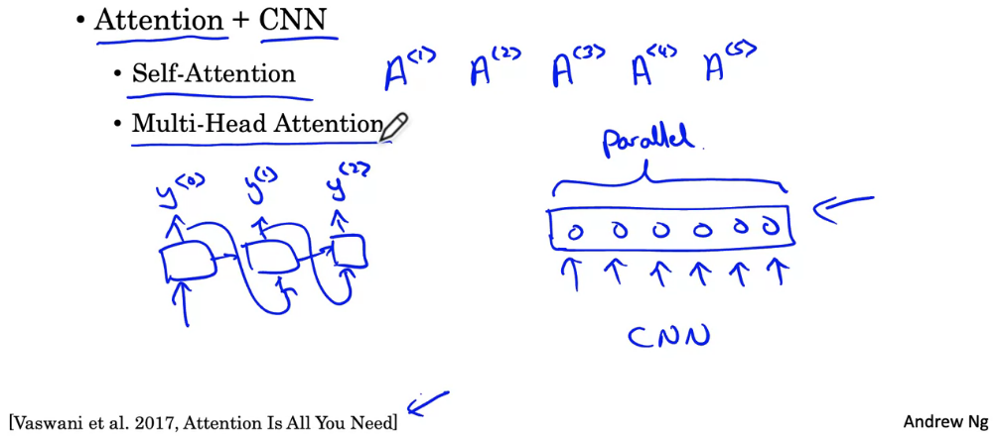

# 1. Intuition
Mô hình từ RNN -> GRU -> LSTM ngày càng phức tạp và tăng độ tính toán lên. Tuy nhiên để xác định được những unit phía sau cần phải xác định được uit phái trước. Transformer architectur ra đời giúp chúng ta thực hiện nhiều tính toán song song hay có thể xử lý cả câu tạo một thời điểm thay vì xử lý từng từ.

# 2. Self Attention

