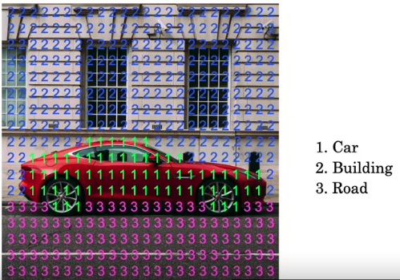
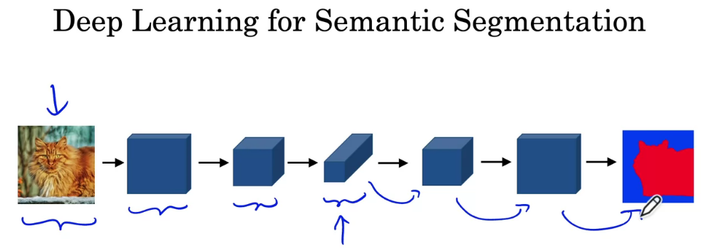
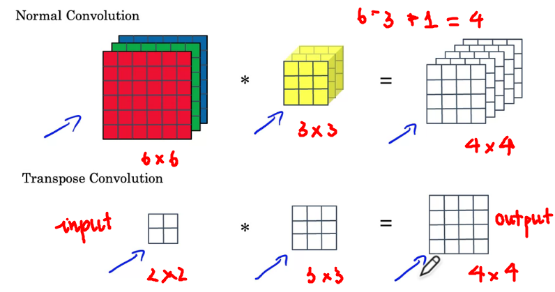
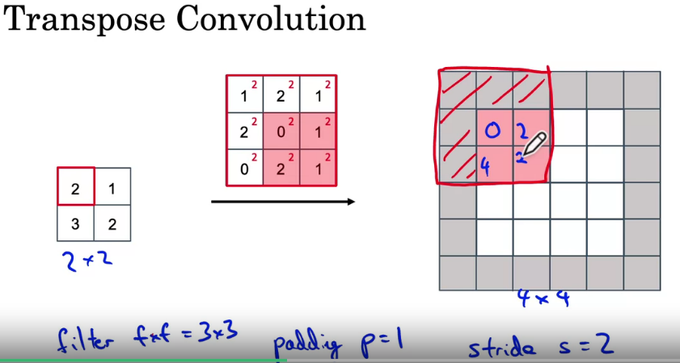
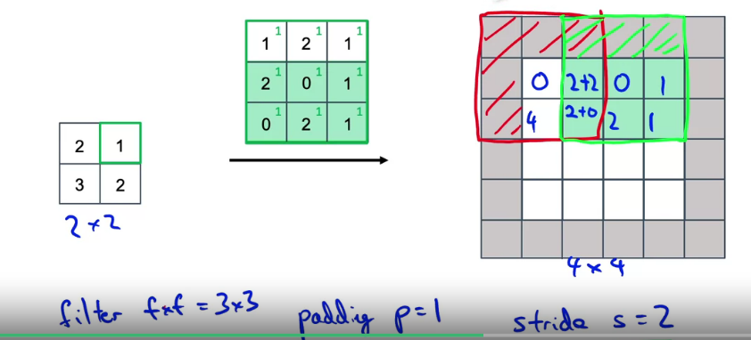
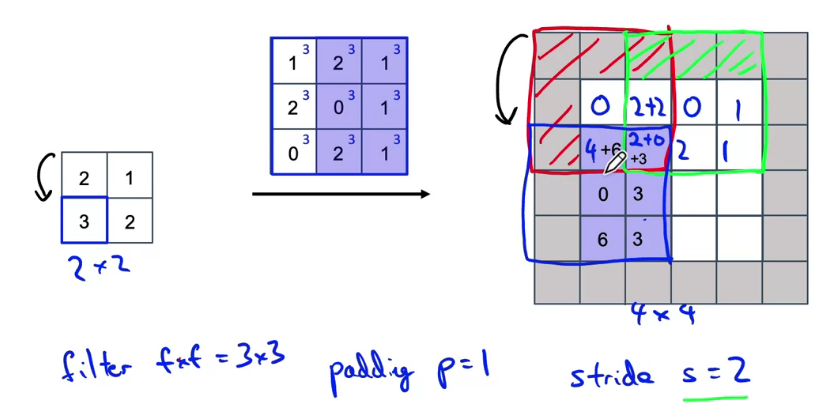
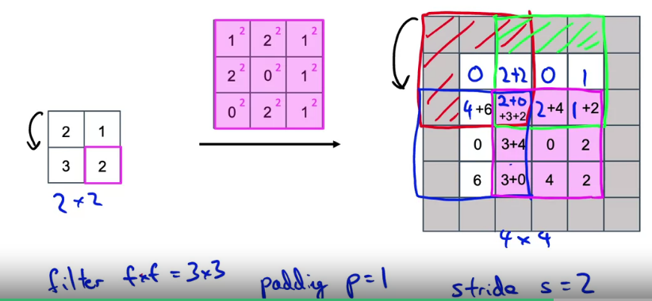
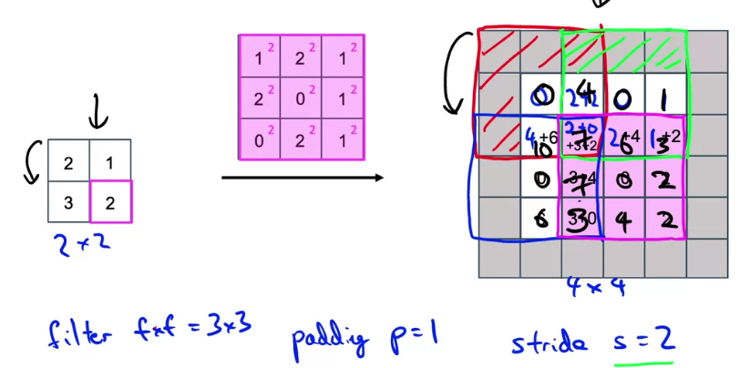
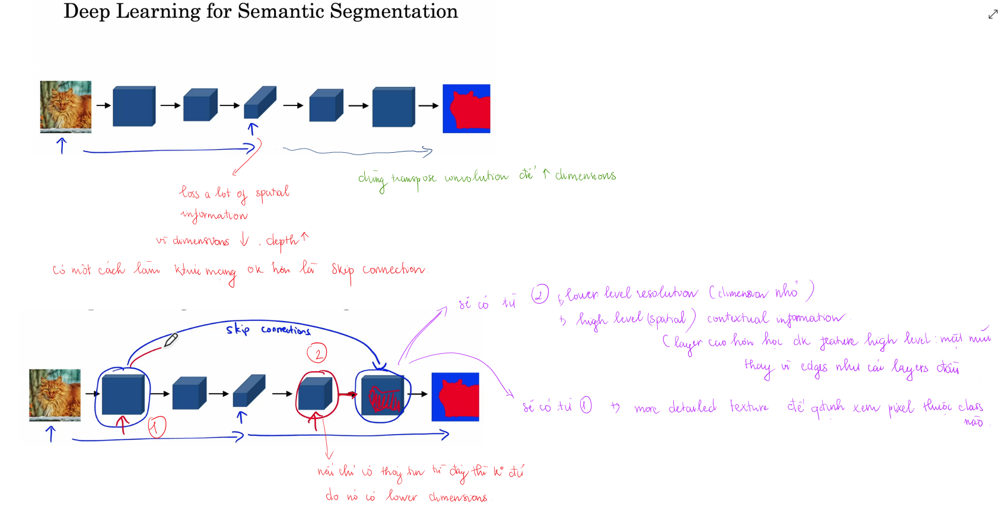
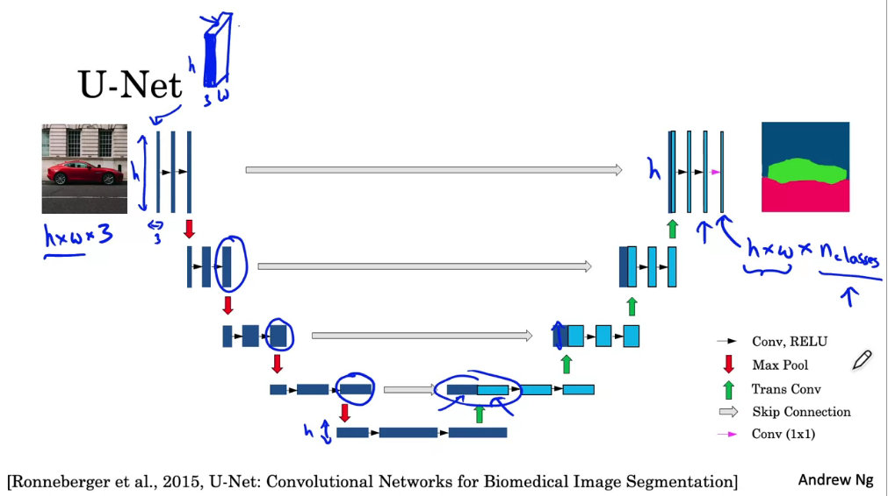

# 1. Mở đầu
Trong bài toán `object detection` chúng ta chỉ cần xác định vị trí các bounding box và class của object. Tuy nhiên các bounding box bao quanh đối tượng, có thể bao luôn những phần không thuộc về đối tượng. Đối với các bài toán y tế hay xe tự hành việc xác định bounding box là chưa đáp ứng được yêu cầu, ví dụ phân tích ảnh y tế không những cần xác định vị trí mà còn cần xác định kích thước các khối u, vị trí bất thường. Đó chính là lý do đời của bài toán `image segmentation`, ta sẽ đi phân lớp các pixels trong ảnh.

Bài toán image segmentation được chia thành 2 loại:
* **Semantic segmentation**: thực hiện segment đối với các lớp khác nhau (chỉ phân biệt giữa các lớp). Một số ứng dụng cảu semantic segmentation:
    ** Xe tự hành: phân lớp pixels đối với xe, đường, người, biển báo... với mục đích xác định vị trí trống của đường...
    ** Trong y tế
    ** Trong nông nghiệp: tránh lạng phí thuốc trừ sâu khi phun thuốc - phân đoạn ảnh với các lớp là cỏ dại và cây trồng (không phun vào cây trồng)
    ** Ảnh không gian: chụp ảnh từ không gian, có thể phân tách các vị trí nhà, đường, cơ sở quân sư. Cái này có thể ứng dụng trong lĩnh vực quân sự...

* **Instance segmentation**: thưc hiện segment đối với các đối tượng khác nhau (phân biệt giữa các đối tượng). Loại này có thể áp dụng để theo dõi hành vi của từng người.

# 2. Mạng Unet
Mạng Unet đầu tiên được ứng dụng trong lĩnh vực y sinh. Kiến trúc của mạng Unet có 2 phần là `encoder` và `decoder` đối xứng nhau, hình dạng kiến trúc giống chữ `U`.

Ý tưởng về kiến trúc mạng ban đầu sẽ như thế này:

## 2.1. Transpose convolution
Đây là kiến thức quan trọng để hiểu được mạng U-net. 

Trong `normal convolution` lất filter đặt lên trên input, nhân element-wise rồi cộng lại. Trong `transpose convolution` sẽ đặt filter lên output.

`Padding`, `stride` đều được thực hiện trên output. Những chỗ overllap với nhau trong vùng của output được cộng dồn lại.

**Intuition about U-Net**

## 2.2. Chi tiết

Mũi tên xanh chính là `transpose convolution`.

Nếu ảnh đầu vào của mình là ảnh màu thì số channels đầu tiên là 3. Ở phần decoder chỗ áp dụng `convolution 1x1` số filter chính là số classes mình cần segment, cái này tùy thuộc vào từng bài toán cụ thể.

## Encoder
Phần này bao gồm các lớp `Conv` và `MaxPooling` thông thường. Đi từ trên xuống dưới `width x height` giảm, còn `depth` tăng. `Depth` của output mỗi layer được ghi ở trên đỉnh hình chữ nhật. `width x height` được ghi dọc theo hình chữ nhật. 

## Decoder
Phần này ngược lại với encoder, làm tăng `width x height` và giảm `depth`. Để làm được điều này cần áp dụng `transposed convolution` (ngược lại với convolution). Mỗi giai đoạn của decoder lại lấy layer phía đối xứng của `encoder` crop rồi concatenate lại (Cách kết nối này tương tự với cách kết nối trong một số kiến trúc như ResNet hay DenNet).

## Loss function
Đây là bài toán phân lớp cho các pixels nên loss function là tổng cross entropy của các pixels trong ảnh

# 3. Tài liệu tham khảo
https://towardsdatascience.com/understanding-semantic-segmentation-with-unet-6be4f42d4b47

https://lmb.informatik.uni-freiburg.de/people/ronneber/u-net/

