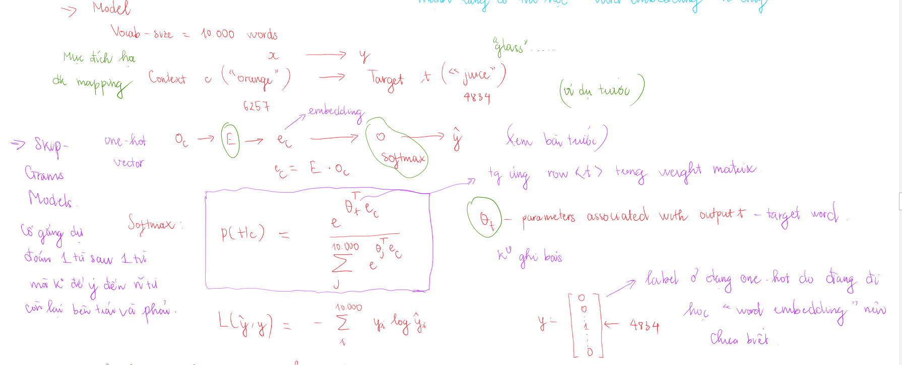

# Word Embedding

## Word representation
Nếu chỉ biểu diễn các word dạng one-hot vector thì `distance` giữa các từ là như nhau, không có sự khác biệt. Điều này sẽ không tốt nếu trong trường hợp chúng ta dự đoán từ. Do đó chúng ta cần có cách biểu diễn các từ khác hợp lý hơn.

Ví dụ như hình trên nhận thấy `orange` và `apple` tương đồng thì có thể dễ dàng dự đoán từ phía sau `apple` là `juice`.

Dưới đây là một cách biểu diễn các từ theo các features

Các từ được biểu diễn bằng vector, do đó độ tương đồng giữa chúng có thể được biểu diễn qua `cosine similarity`

## Embedding matrix

Muốn thực hiện được `word embedding` thì chúng ta cần học được `embedding matrix`.

Ví dụ vocabulary có `vocab_size` là 10000. Khi đó mỗi từ được biểu diễn bằng one-hot vetor (10000, 1). Để có thể biểu diễn từ theo `word embedding` với chiều 300, chúng ta sẽ cần `embedding matrix` có chiều (300, 10000). Khi đó lấy tích `embedding matrix` với one-hot vector ta được embedding của từng từ. 

Có một cách để nhớ kích thước của `embedding matrix`: giống bên NN coi one-hot vetor là layer trước, word embedding là vector sau. Khi đo kích thước cảu `embedding matrix` là `300 x 10000`.

`Embedding matrix` được kí hiệu là `E`. One-hot vector được kí hiệu là `o_j`, word embedding được kí hiệu là `e_j`. `j` chỉ chỉ số của từ trong vocabulary.

Ở phần trên nhận thấy one-hot vector có các phần tử đa phần đều = 0 và không có tác dụng trong việc tính toán. Việc lưu trữ tất cẩ các số 0 như vậy sẽ gây lãng phí bộ nhớ chúng ta cần có cách biểu diễn khác hợp lý hơn thay vì phép nhân ma trận để xác định `word embedding`.

**Nhận thấy embedding của từ trùng với cột của `embedding matrix` có cùng chỉ số.** Do đó chúng ta cần có hàm để tìm ra vị trí của column tương ứng với `word embedding` cần tìm thay vì phải thực hiện phép nhân ma trận thông thường. Trong Keras có `Embedding layer` có thể lấy ra cột tương ứng với từ

Trong bài sau chúng ta sẽ tìm hiểu các học `embedding matrix`, đầu tiên sẽ khởi tạo nó randomly.

**Ghi nhớ**: Các cột của  embedding matrix chứa các embedding của các từ trong vocabulary.

# Learning Word Embedding: Word2vec, Glove
## Learning Word Embedding
Đầu tiên chúng ta và đi vào thuật toán phức tạp hơn một chút để có `intuition` về word embedding. Sau này sẽ đi vào những cái đơn giản hơn nhưng vẫn hoạt động tốt. 

Trong bài toán `language model` dự đoán từ tiếp theo khi biết các từ đứng trước đó. Đây là một algorithm cho phép chúng ta học được `embedding matrix`, chính là xác định được `word embedding`. 

Đối với bài toán `language model` dự đoán 1 từ (`target word`) khi cho trước các từ phía trước (`context`) chúng ta có thể học được `word embedding`. Tuy nhiên nếu mục đích chính của chúng ta là học `word embedding` chúng ta có thể sử dụng các `context` khác như các từ sau nó, 1 từ trước nó hay 1 từ cách xa nó cũng có thể đem đến các word embedding có nhiều ý nghĩa. Đây chính là ý tưởng của **Skip Gram model**.

## Word2vec
Word2vec là một algorithm đơn giản và hiệu quả để học `word embedding`. Word2vec có 2 model:
    - **Word2vec Skip-grams model**
    - **Word2vec CBOW** (context của model này là casctuwf 2 bên, đi dự đoán the middle word)

* **Skip-grams**

Mục đấy lấy ngẫu nhiên các `context word` trong câu và chọn ngẫu nhiên các `target word` ở trong một khoảng cách  nào đó. Mục đích của việc này là để xây dựng bài toán supervised learning. Khi test, thì cho `context word` và đi dự đoán target word ở trong khoảng đó.

Đây là vấn đề khó, bài toán có thế có rất nhiều dữ liệu, tuy nhiên cần nhấn mạnh rằng thông qua việc này chúng ta có thể học được `word embedding`.

* **Model**

Đây chính là `Skip-grams model` do nó dự đoán `target word` sau `context word` mà không để ý đến các từ còn lại đứng bên trái hay bên phải.

Tuy nhiên có một số vấn đề với algorithm này: Việc tính toán hàm softmax rất tốn kém, có đến `vocab_size` phép tính cho 1 dự đoán (nguyên phép cộng bên dưới mẫu). Điều này gây khó khăn cho việc tăng kích thước vocabulary.

Cần để ý thêm việc chọn `context word` do có một số từ sẽ xuất hiện nhiều lần hơn. Nếu chọn ngẫu nhiên thì khả năng những từ này xuất hiện cao hơn, đây là điều không mong muốn. Ta cần cả những từ ít thường xuyên hơn làm `context word` vì nhiều khi những từ này sẽ có thể đưa ra các dự đoán tốt hơn

