# Word Embedding

## Word representation
Nếu chỉ biểu diễn các word dạng one-hot vector thì `distance` giữa các từ là như nhau, không có sự khác biệt. Điều này sẽ không tốt nếu trong trường hợp chúng ta dự đoán từ. Do đó chúng ta cần có cách biểu diễn các từ khác hợp lý hơn.

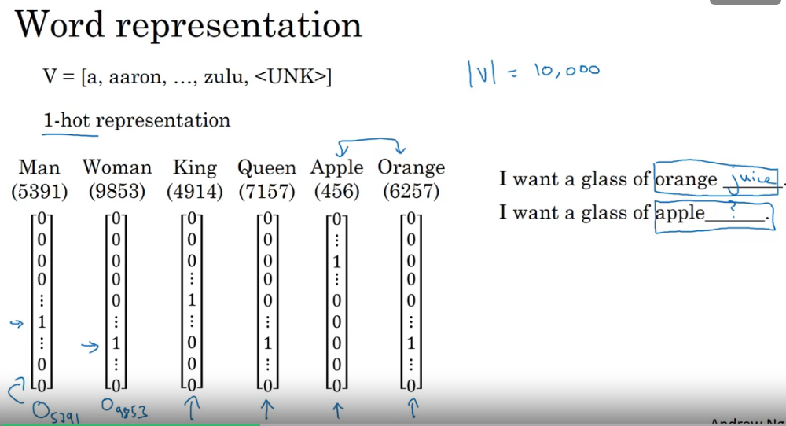

Ở đây dùng kí hiệu ví dụ $O_{5391}$ để chỉ one-hot vector với giá trị 1 ở index 5391.

Giả sử trong câu đầu tiên đã học được điền `orange` vào chỗ trống. Nhận thấy `orange` và `apple` tương đồng thì có thể dễ dàng dự đoán từ phía sau `apple` là `juice`. Tuy nhiên do chúng được biểu diễn dưới dạng ont-hot vector nên mối quan hệ giữa `orange` và `apple` cũng giống như các từ khác, do đó rất khó để nó dự đoán chính xác từ cần điền. 

Thay vì biểu diễn các từ dưới dạng one-hot vector chúng ta tìm cách biểu diễn các từ theo features. Cách biểu diễn này có thể học được.

Ỏ đây dùng kí hiệu ví dụ $e_{5391}$ để chỉ vector biểu diễn từ (e kí hiệu của embedding), chỉ số bên dưới tương ứng với chỉ số mà giá trị bằng 1 trong one-hot vector tương ứng với từ đó.

Các từ được biểu diễn bằng vector, do đó độ tương đồng giữa chúng có thể được biểu diễn qua `cosine similarity`. Như cách biểu diễn trên nhận thấy `orange` và `apple` tương đồng với nhau.

Trong các bài sau chúng ta sẽ tìm cách để học **word embedding**. Tất nhiên việc chọn các features để biểu diễn từ theo các features đó là khó, tuy nhiên cuối cùng chúng ta có cách biểu diễn các từ trong đó `orange` tương đồng với `apple` hơn so với `king` hay `woman`. 

**Visualizing word embeddings**

Bình thường nếu dimensions của word embedding lớn chúng ta không thể biểu diễn được. Tuy nhiên chúng ta có cách để giảm chiều word embedding xuống để biểu diễn, ví dụ giảm chiều xuôngs 2D, 3D. Một số phương pháp để giảm chiều dữ liệu hay dùng là t-SNE, PCA...

## Using Word Embedding

Trong bài này chúng ta tìm hiểu cách sử dụng woed embedding vào các ứng dụng NLP. 

**Transfer learning and word embedding**

- Học word embedding từ bộ dữ liệu lớn (1-100B words) hoặc có thể downlaod pre-trained word embeddings
- Thực hiện transfer word embeddings này với new task trên bộ dữ liệu nhỏ hơn (ví dụ 100k words)
- Tùy chọn: có thể fine tune word embedding trên bộ dữ liệu mới

Word embedding có mối tương đồng với face encoding. 

## Properties of word embedding

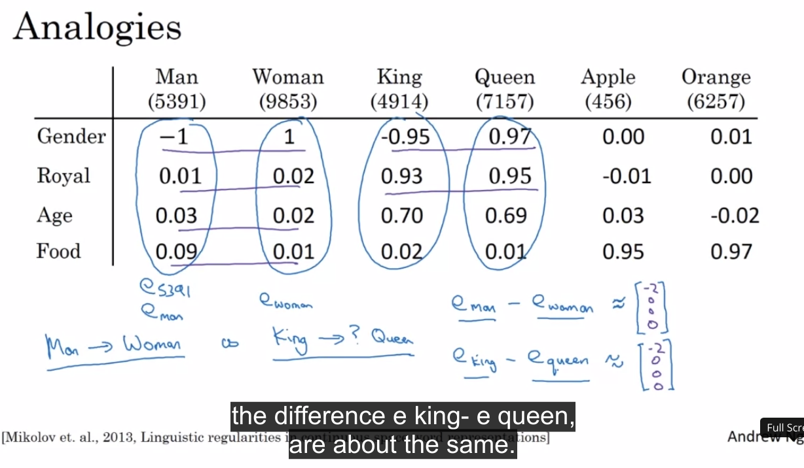

Nhận thấy `man` và `woman` khác nhau chủ yếu về gender, `king` và `queen` cũng khác nhau chủ yếu về gender, do đó:

$$e_{man} - e_{woman} \approx e_{king} - e_{queen}$$

**Analogies using word vectors**

Có một cách để thực hiện **analogy reasoning** (lập luận tương tự) 

$$e_{man} - e_{woman} \approx e_{king} - e_{?}$$

Chúng ta cần đi tìm word $w$ thỏa mãn điều kiện trên:

$$\underset{w}{\text{argmax}}~\text{sim}(e_w, e_{king} - e_{man} + e_{woman})$$

**Cosine similarity**

$$sim(\mathbf{u}, \mathbf{v}) = \frac{u^Tv}{||u||_2~||v||_2}$$

## Embedding matrix - tìm hiểu cách học word embedding

Muốn học được **word embedding** thì chúng ta cần học được **embedding matrix**.

Ví dụ vocabulary có `vocab_size` là 10000. Khi đó mỗi từ được biểu diễn bằng one-hot vetor (10000, 1). Để có thể biểu diễn từ theo `word embedding` với chiều 300, chúng ta sẽ cần **embedding matrix** có chiều (300, 10000). Khi đó lấy tích embedding matrix với one-hot vector tương ứng với từ ta được word embedding của từ đó.

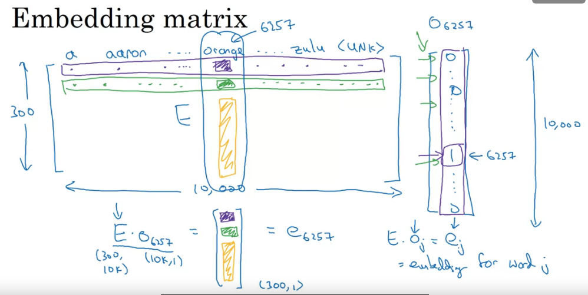

$$E \cdot e_{6257} = o_{6257}$$

trong đó embedding matrix được kí hiệu là $E$. One-hot vector được kí hiệu là $o$, word embedding được kí hiệu là $e$. Chỉ số bên duois tương ứng với chỉ số của từ trong vocabulary.

Có một cách để nhớ kích thước của embedding matrix: giống bên NN coi one-hot vetor là layer trước, word embedding là layer sau. Khi đo kích thước của embedding matrix là `300 x 10000`.

Ở phần trên nhận thấy one-hot vector có các phần tử đa phần đều = 0 và không có tác dụng trong việc tính toán. Việc lưu trữ tất cả các số 0 như vậy sẽ gây lãng phí bộ nhớ chúng ta cần có cách biểu diễn khác hợp lý hơn thay vì phép nhân ma trận để xác định word embedding.

**Nhận thấy embedding của từ trùng với cột với chỉ số tương ứng trong embedding matrix.** Do đó chúng ta cần có hàm để tìm ra vị trí của column tương ứng với word embedding cần tìm thay vì phải thực hiện phép nhân ma trận thông thường. Trong Keras có Embedding layer có thể lấy ra cột tương ứng với từ. 

**Ghi nhớ**: Các cột của embedding matrix chứa các embedding của các từ trong vocabulary.

## Learning Word Embedding

Chúng ta đi vào cụ thể các thuật toán học word embedding. Đầu tiên chúng ta và đi vào thuật toán phức tạp hơn một chút để có `intuition` về word embedding. Sau này sẽ đi vào những thuật toán đơn giản hơn nhưng vẫn hoạt động tốt. 

Trong bài toán language model dự đoán từ tiếp theo khi biết các từ đứng trước đó có sử dụng mạng NN. Hóa ra việc xây dựng mạng NN là một cách để học embeddings, Đây là một algorithm cho phép chúng ta học được **embedding matrix** để xác định được word embedding. 

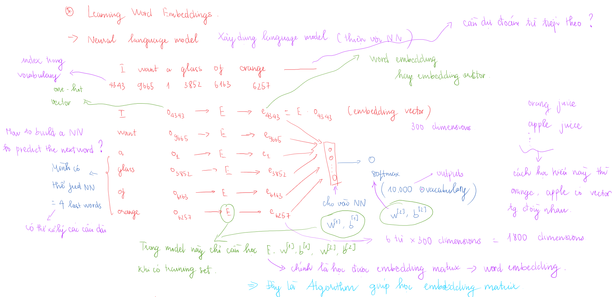

Bên trên là cách xây dựng model để dự đoán từ tiếp theo. Layer đầu tiên thể hiện số input đầu vào ở dạng one-hot vector, layer tiếp theo cũng có số unit tương tự như vậy nhưng ở dạng word embedding. Ma trận hệ số chúng a cần học giữa hai layer này chính là embedding matrix. Chúng ta stack các word embedding lại với nhau rồi cho qua FC layer và cuối cùng là softmax layer (label có thể vẫn để ở dạng one-hot vector thôi). Giữa các layers trên có hệ số. Việc học các hệ số này cùng embedding matrix chính là đang đi xây dựng mạng NN để dự đoán từ.

Đối với bài toán `language model` dự đoán 1 từ **target word** khi cho trước các từ phía trước (gọi là **context**) chúng ta có thể học được word embedding. Tuy nhiên nếu mục đích chính của chúng ta là học word embedding chúng ta có thể sử dụng nhiều context khác như như sau: có thể sử dụng các từ sau target word, có thể sử dụng 1 từ trước nó hay 1 từ cách xa nó cũng có thể đem đến các word embedding có nhiều ý nghĩa. Đây chính là ý tưởng của **Skip Gram model**.
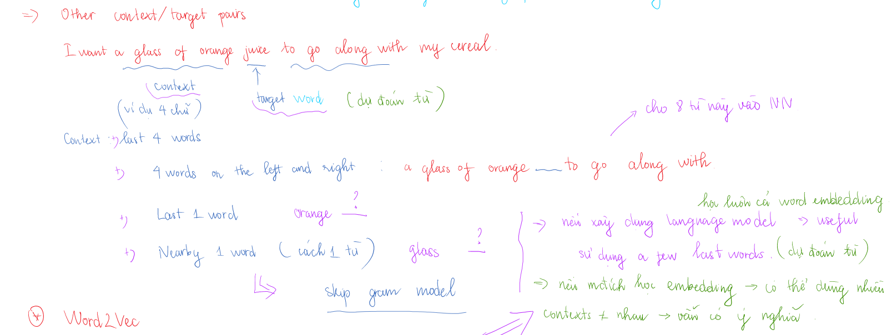

## Word2Vec
Word2vec là một algorithm đơn giản và hiệu quả để học word embedding. Có 2 cách để thực hiện Word2Vec:
- **Skip-grams model**
- **CBOW - Common Bag of Words** (context của model này là các từ 2 bên, đi dự đoán the middle word).

https://towardsdatascience.com/introduction-to-word-embedding-and-word2vec-652d0c2060fa

https://towardsdatascience.com/introduction-to-word-embedding-and-word2vec-652d0c2060fa

**Skip-grams**

Ý tưởng chính của Skip-Grams là lấy ngẫu nhiên **context word** trong câu và chọn ngẫu nhiên **target word** ở trong một khoảng cách nào đó (vẫn thuộc câu trên, +- một số lượng từ). Ở đây mình có dataset tập hợp các câu chẳng hạn. Mục đích của việc này là để xây dựng bài toán supervised learning. Khi test, thì cho context words và đi dự đoán target word ở trong khoảng đó.

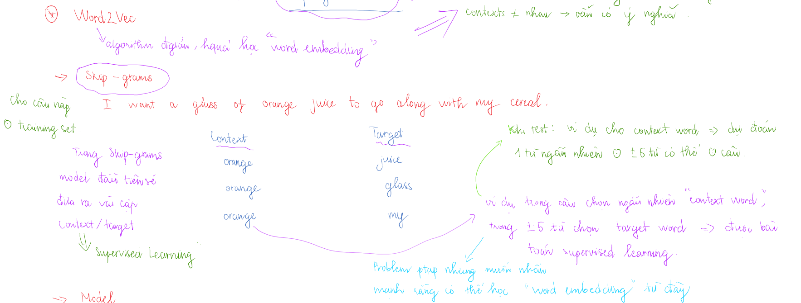

Hình bên dưới sẽ thể hiện rõ hơn cách lấy các từ trong một khoảng nào đó.

Ví dụ có câu *I will have orange juice and eggs for breakfast*, window size = 2. Nếu target word là *juice*, các hàng xóm của nó là (*have, orange, and, eggs*). Chúng ta sẽ có cặp từ input, target word *(juice, have), (juice, orange), (juice, and), (juice, eggs)*.

>Chú ý: Trong một số tài liệu và bài giảng có thể cách dùng từ context word và target word ngược nhau nhưng mục đích không đổi. Chọn một từ và các từ xung quang trong khoảng window size để tạo thành các cặp từ.

Model có tên là **Skip-Grams model** do nó khi biết một từ nó sẽ dự đoán từ xung quanh trong koảng window size (không quan tâm các từ còn lại đứng bên trái hay bên phải).

*Kiến trúc của Skip-Grams*

Tóm gọn: $o \to E \to e \to o(softmax) \to \hat{y} $, với $e = E \cdot o$

Input layer có số units là V - vocabulary size - one hot vector. Hidden layer có số units là N - số chiều embedding. Output layer có số units là V - vocabulary size - one hot vector (label khi training tương ứng 1 từ). Tuy nhiên khi test mỗi giá trị ở unit chính là probability score của từ tương ứng với vị trí của unit đó. Điều này có nghĩa rằng từ đó nằm trong khonagr window size của từ ban đầu với probaility như vậy (hình ngay bên trên vẽ nhiều vector ở output layer chỉ để biểu diễn thôi, thực tế có V units).

Loss function của bài toán này là cross entropy như bình thường thôi

Đây là vấn đề khó, bài toán có thế có rất nhiều dữ liệu khi khoảng window size lớn, tuy nhiên cần nhấn mạnh rằng thông qua việc này chúng ta có thể học được word embedding.

Tuy nhiên có một số vấn đề với algorithm này: Việc tính toán hàm softmax rất tốn kém, có đến vocab_size phép tính cho 1 dự đoán (nguyên phép cộng bên dưới mẫu). Điều này gây khó khăn cho việc tăng kích thước vocabulary.

$$p(t|c) = \frac{e^{\theta_t^{T} \mathbf{e}_c}}{\sum_{j=1}^{100} e^{\theta_j^{T} \mathbf{e}_c}}$$

trong đó $\mathbf{e}_c$ là word embedding của input word $c$. Có một số giải pháp cho vấn đề này như **hierrachical softmax classifier**. Thay vì phân loại vào 10000 nhóm trong cùng một lần chúng ta sẽ thực hiện nhiều lần, mỗi lần phân vào một nhóm khác nhau. Độ phức tạp tính toán của hierrachical softmax classifier chỉ là $log(V)$ do đó chúng ta có thể mở rộng vocabulary được.

**Cần để ý thêm việc chọn context word** (input) do có một số từ sẽ xuất hiện nhiều lần hơn. Nếu chọn ngẫu nhiên thì khả năng những từ này xuất hiện cao hơn, đây là điều không mong muốn. Ta cần cả những từ ít thường xuyên hơn làm context word (input) vì nhiều khi những từ này sẽ có thể đưa ra các dự đoán tốt hơn

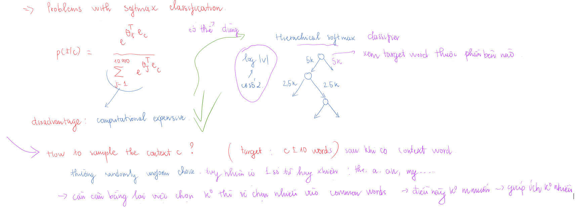

Như vừa nói hai ban đầu có 2 cách thực hiện Word2Vec là Skip-Gram model và CBOW. Cách xây dựng training set của CBOW hơi ngược so với Skip-Gram, còn lại mọi thứ giống nhau nên không tìm hiểu thêm:
- Trong Skip-Gram có một từ đi dự đoán các từ bên cạnh. Lấy training examples: (w(t), w(t-1)), (w(t), w(t-2)), (w(t), w(t+1)), (w(t), w(t+1))
- Trong CBOW cũng có một từ đi dự đoán từ bên cạnh. Lấy training examples: (w(t-2), w(t)), (w(t-1), w(t)), (w(t+1), w(t)), (w(t+2), w(t)).

### Negative sampling 

Bài trước đã học về Skip-grams model cho phép chúng ta xây dựng bài toán supervised learning. Nó map từ context word đến target word và cho phép học được word embedding. Tuy nhiên Skip-Gram model ban đầu có vấn đề tính toán lớn với hàm softmax do đó trong bài này sẽ đưa ra một algorithm mới (tương tự như Skip-Grams) nhưng có thay đổi một chút và hiệu quả hơn.

http://mccormickml.com/2017/01/11/word2vec-tutorial-part-2-negative-sampling/

https://arxiv.org/abs/1310.4546

**Xây dựng training set**

Trong algorithm mới này chúng ta sẽ thay đổi các tạo training set so với Word2Vec. Ở đây example là các cặp **(context word, target word)**, label là **positive/negative**. Context word được chọn ngẫu nhiên trong câu:
- Đối với **positive example**, target word được chọn ngẫu nhiên trong câu đó trong khoảng cách window size của context word. 
- Đối với **negative example** target word được chọn ngẫu nhiên từ *vocabulary*. Số lượng negative example ứng với một context word $k = 5 - 10$ dataset nhỏ (ít câu), $k = 2 - 5$ dataset lớn (nhiều câu). 

*I want a glass of orange juice to go along with my cereal.*
| Context word | Word        | Target? |
| -----------  | ----------- | ------
| orange       | juice       | 1       |
| orange       | king        | 0       |
| orange       | book        | 0       |
| orange       | the         | 0       |
| orange       | of          | 0       |

>Chú ý: khi lấy negative example từ dictionary từ đó có thể nằm trong câu cùng với context word nhưng mình vẫn đánh dấu là negative example (đang lấy ngẫu nhiên). Ví dụ ở trên có từ *of*.

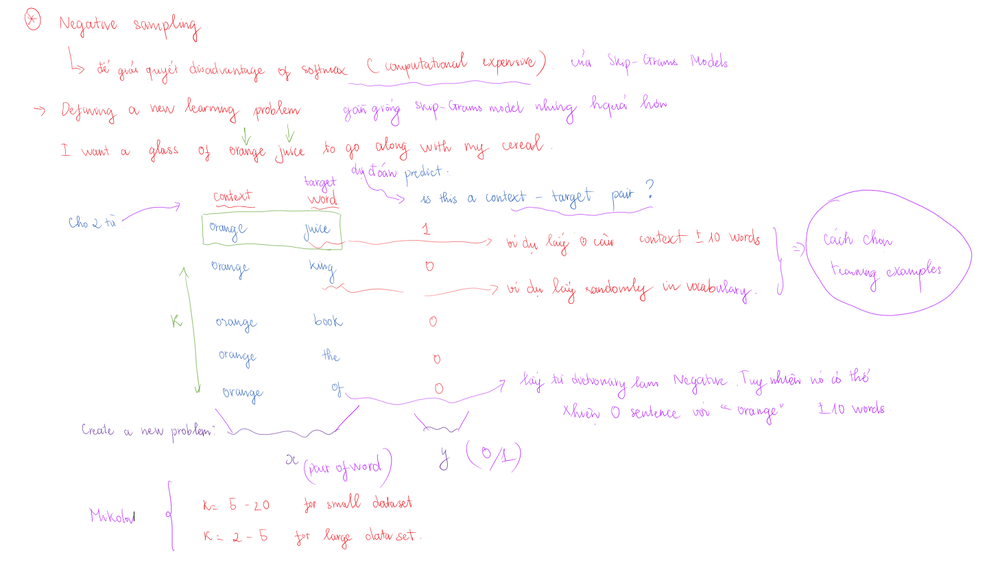

Lúc này chúng ta có bài toán supervised learning với **input** là cặp từ, **output** là target label.

Hình trên cho thấy cách chúng ta học được embedding matrix từ phương pháp **Negative sampling** như thế nào. 

Thuật toán có tên **Negative Sampling** do ứng với mỗi **postive example** từ câu lại đi tìm các cặp **negative example** từ vocabulary. Algorithm này giảm được việc tính toán ở softmax layer, bây giờ chuyển qua binary classification, mỗi lần chỉ thực hiện số một phép tính (sigmoid activation function) thay vì 10000 như softmax layer của Skip-grams model gốc do chúng ta đã thay đổi vấn đề một chút. Softmax layer kia tương tự như 10000 logistic regression, còn bên negative sampling chúng ta cần training $k+1$ cái logistic regession, tiết kiệm tính toán hơn nhiều ứng với mỗi context word được chọn.

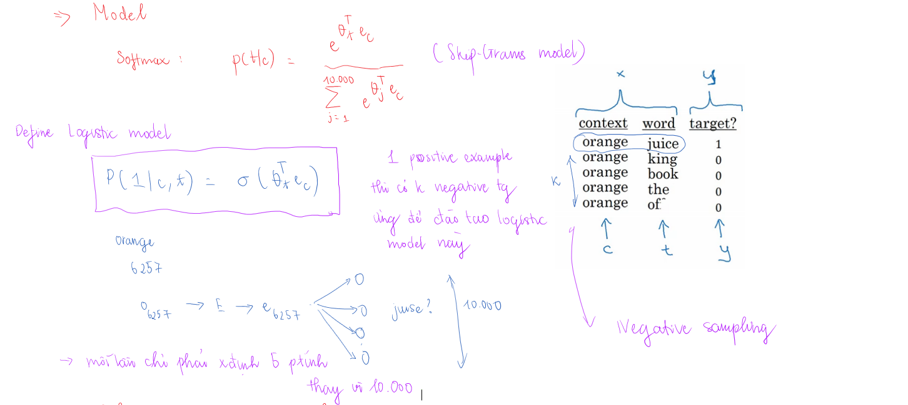

Một vấn đề của **Negative sampling** là cách chọn negative example như nào cho phù hợp sau khi đã chọn context word? Không thể chọn uniform randomly được vì có những từ hay xuất hiện trong các đoạn text sẽ ảnh hưởng đến model của mình. Các nhà nghiên cứu có đưa ra công thức thực hiện xác định xác suất lấy các từ trong vocabulary dựa vào tần suất xuất hiện của chúng trong các đoạn text.

$$p(w_i) = \frac{f(w_i)^{3/4}} {\sum_{j}^{10000} f(w_i)^{3/4}}$$

ở đây $f(w_i)$ - số lần xuất hiện của từ $w_i$ trong các đoạn text (không phải trong vocabulary, vì trong vocabulary chỉ chứa các từ khác nhau thôi).

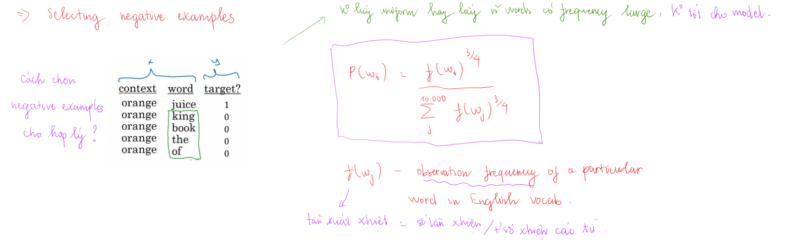

## Glove Word vector
Cái này không được sử dụng nhiều như Word2vec nhưng do sự đơn giản nên vẫn có một số nhóm hay dùng. 
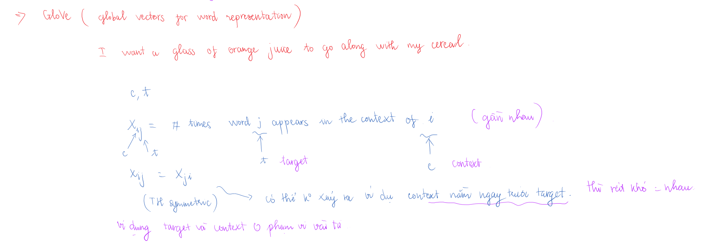

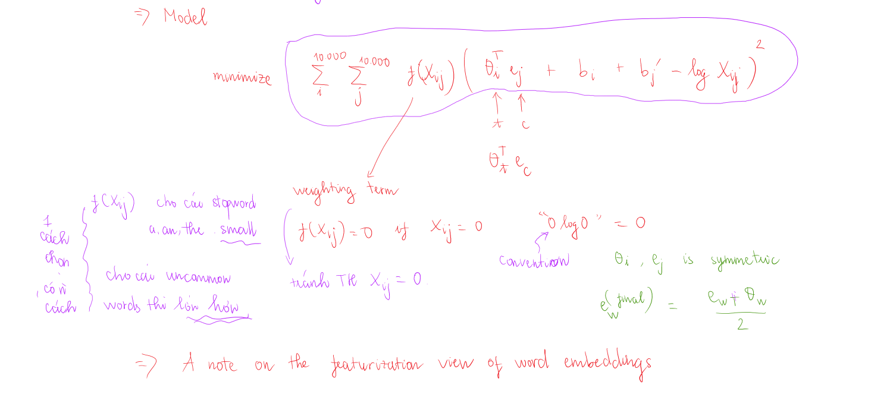

# Applications Using word embedding
## Sentiment classification - phân loại thái độ 

Sentiment classification: nhìn vào một đoạn text rồi phân biệt đó là nội dung tích cực hoặc tiêu cực. Một vấn đề ới sentiment classification là không có đủ label training set. Tuy nhiên với `word embedding` chúng ta có thể xây dựng bộ phân loại tốt được ngay cả khi có ít training set. 

Nếu xây được bộ phân loại này có thể đánh giá được các comments để lại với một dịch vụ nào đó, sau đó có hướng điều chỉnh làm dịch vụ tốt hơn. 
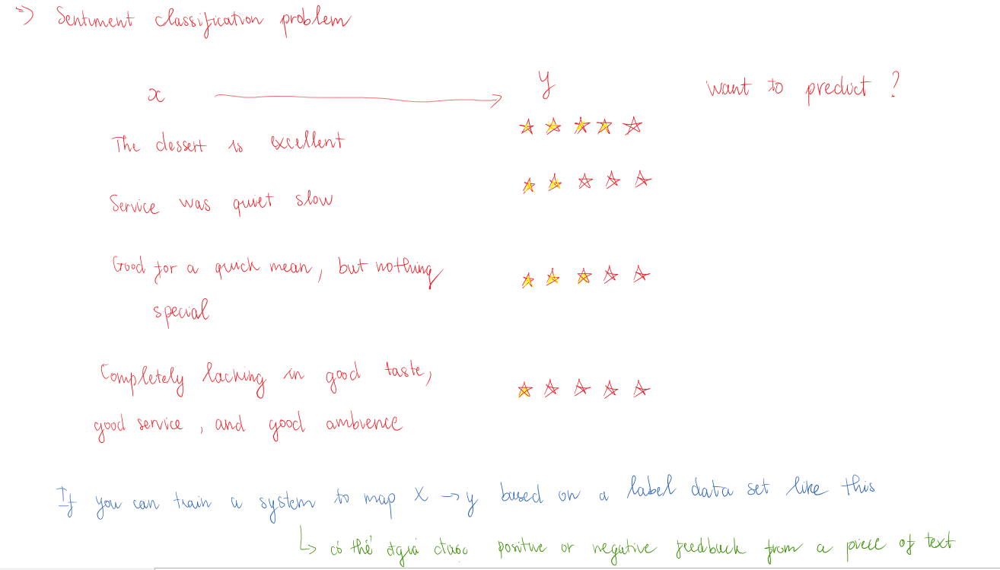

### Simple model

Có thể dùng mô hình đơn giản như sau cho bài toán phân loại thái độ.
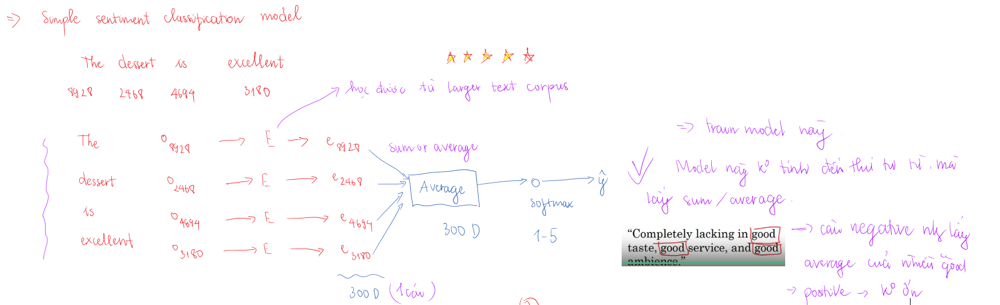
`Word embedding` được học từ tập dữ liệu rất lớn. Ở trong mô hình này ma trận E đã biết rồi.s
Tuy nhiên mô hình này không tính thứ tự của các từ mà lấy trung bình hoặc tổng các vector để đưa vào softmaxx layer, điều này có thể gây ra một số sai sót không muốn như ví dụ trong hình. Nếu lấy trung bình có rất nhiều từ `good` nhưng thực ra câu này lại là `negative`.

Thử ứng dụng mô hình RNN để giải quyết bào toán setiment classification xem sao.

### RNN for sentiment classification
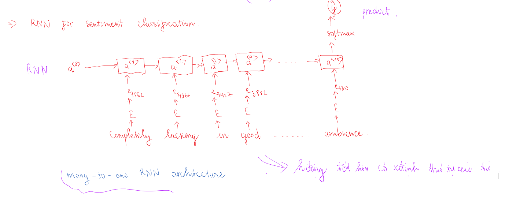

## Debiasing Word Embeddings
