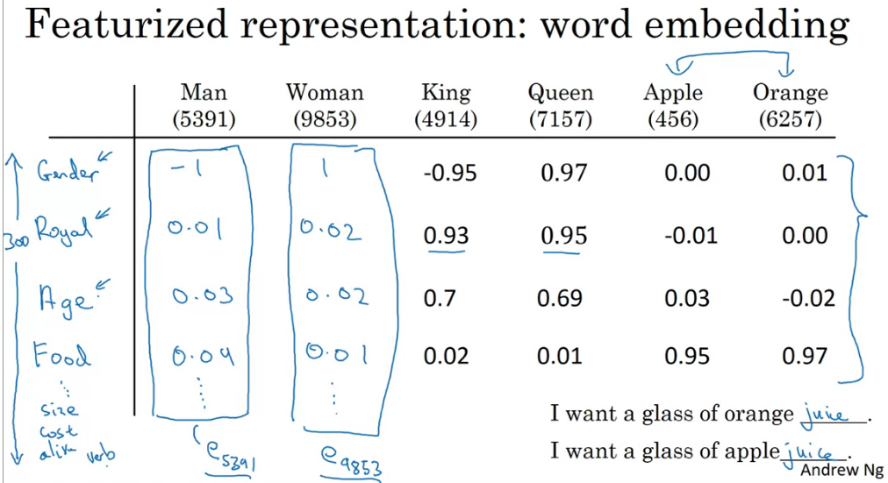

# Word Embedding

## Word representation
Nếu chỉ biểu diễn các word dạng one-hot vector thì `distance` giữa các từ là như nhau, không có sự khác biệt. Điều này sẽ không tốt nếu trong trường hợp chúng ta dự đoán từ.

Ví dụ như hình trên nhận thấy `orange` và `apple` tương đồng thì có thể dễ dàng dự đoán từ phía sau `apple` là `juice`.

Các từ được biểu diễn bằng vector, do đó độ tương đồng giữa chúng có thể được biểu diễn qua `cosine similarity`

## Embedding matrix

Muốn thực hiện được `word embedding` thì chúng ta cần học được `embedding matrix`.

Ví dụ vocabulary có `vocab_size` là 10000. Khi đó mỗi từ được biểu diễn bằng one-hot vetor (10000, 1). Để có thể biểu diễn từ theo `word embedding` với chiều 300, chúng ta sẽ cần `embedding matrix` có chiều (300, 10000). Khi đó lấy tích `embedding matrix` với one-hot vector ta được embedding của từng từ. 

Có một cách để nhớ kích thước của `embedding matrix`: giống bên NN coi one-hot vetor là layer trước, word embedding là vector sau. Khi đo kích thước cảu `embedding matrix` là `300 x 10000`.

`Embedding matrix` được kí hiệu là `E`. One-hot vector được kí hiệu là `o_j`, word embedding được kí hiệu là `e_j`. `j` chỉ chỉ số của từ trong vocabulary.

Ở phần trên nhận thấy one-hot vector có các phần tử đa phần đều = 0 và không có tác dụng trong việc tính toán. Việc lưu trữ tất cẩ các số 0 như vậy sẽ gây lãng phí bộ nhớ chúng ta cần có cách biểu diễn khác hợp lý hơn thay vì phép nhân ma trận để xác định `word embedding`.

**Nhận thấy embedding của từ trùng với cột của `embedding matrix` có cùng chỉ số.** Do đó chúng ta cần có hàm để tìm ra vị trí của column tương ứng với `word embedding` cần tìm thay vì phải thực hiện phép nhân ma trận thông thường. Trong Keras có `Embedding layer` có thể lấy ra cột tương ứng với từ

Trong bài sau chúng ta sẽ tìm hiểu các học `embedding matrix`, đầu tiên sẽ khởi tạo nó randomly.

**Ghi nhớ**: Các cột của  embedding matrix chứa các embedding của các từ trong vocabulary.

